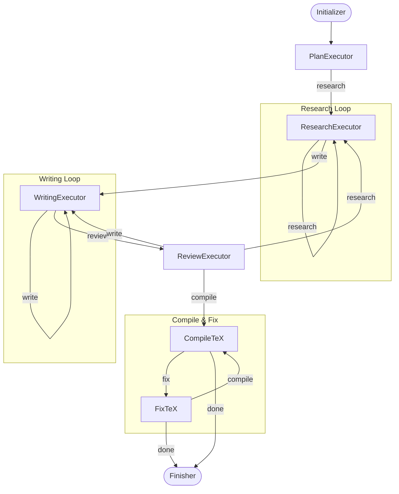

# Nano-scientist

> **Nano. Lean. Two loops, one budget, one paper.**


An autonomous research agent that turns a topic into a peer-reviewed technical report — within a dollar budget you set. The entire agent is ~4 files, 8 nodes, ~20 skills. No framework bloat, no orchestration overhead.

Built on [PocketFlow](https://github.com/The-Pocket/PocketFlow). Directly inspired by [karpathy/autoresearch](https://github.com/karpathy/autoresearch): fix the budget, run the loops, let the agent figure out the rest.

---

## How it works



### Stage breakdown

| Stage | What happens |
|---|---|
| **Initializer** | Infers report type from budget, sets up `outputs/<uuid>/` — zero LLM calls |
| **PlanExecutor** | One LLM call — drafts a 3–7 step ordered research plan (feedforward); stores it in shared state so each loop iteration can mark items done (feedback) |
| **ResearchExecutor** | Autonomous loop: follows plan → picks one skill per iteration, decomposes it inline (2–5 steps), executes; marks plan items complete; self-loops until budget threshold; supports *scoped mode* for revision-directed research |
| **WritingExecutor** | Autonomous loop: picks one section per iteration, writes LaTeX; self-loops until all sections done; supports *scoped mode* for targeted rewrites |
| **ReviewExecutor** | Assembles the full draft and runs peer-review; dispatches the top major comment directly to research or rewrite; returns `compile` when the draft is accepted |
| **CompileTeX** | Runs `pdflatex` + `bibtex` to produce a PDF — runs **exactly once** |
| **FixTeX** | Patches undefined citations or LaTeX errors and recompiles |
| **Finisher** | Writes `cost_log.json` + `summary.json`, prints total cost |

> **Why nano?** The core is intentionally tiny — 4 source files, ~1,100 lines total. Three mandatory stages (Research → Write → Review) with the review node handling revision dispatch directly. The budget is the only knob.

---

## Quickstart

```bash
# 1. Clone
git clone https://github.com/your-org/nano-scientist
cd nano-scientist

# 2. Install dependencies
pip install -r requirements.txt

# 3. Add API keys
cp .env.example .env
# edit .env — at minimum set OPENROUTER_API_KEY

# 4. Run
python main.py "CRISPR off-target effects in primary T cells" --budget 1.00
```

Output lands in `outputs/<uuid>/`:

```
outputs/
└── <uuid>/
    ├── report.tex         # assembled LaTeX source
    ├── report.pdf         # final PDF (if pdflatex installed)
    ├── references.bib     # deduplicated BibTeX
    ├── artifacts/         # per-skill markdown outputs
    ├── figures/           # generated plots / images
    ├── data/              # collected CSV / JSON data
    ├── scripts/           # executed code blocks
    ├── history.json       # step-by-step execution log
    ├── cost_log.json      # per-step token costs
    └── summary.json       # final run summary
```

---

## CLI reference

```
python main.py <topic> [options]

Arguments:
  topic                 Research question (string or path to a .md file)

Options:
  -b, --budget FLOAT    Spend limit in USD  (default: $5.00)
  -o, --output DIR      Output directory    (default: outputs/)
  -e, --env FILE        Path to .env file   (default: .env)
  --list-skills         Print available skills and exit
```

### Budget tiers

Report type is inferred from budget at startup. Actual cost depends on model pricing, skill mix, and how many review/revision cycles occur.

| Budget | Report type | Sections | Notes |
|---|---|---|---|
| < $0.10 | Quick Summary | 4 | 1–2 skill calls; minimal citations |
| $0.10 – $0.50 | Literature Review | 5 | Several skill calls; may exhaust budget before all sections written |
| $0.50 – $2.00 | Research Report | 7 | Typical run with methods + results |
| $2.00 – $5.00 | Full Paper | 8 | Multiple review/revision cycles possible |
| $5.00+ | Full Paper | 8 | Extended research depth; more skills, more citations |

---

## Skills

Each skill is a folder under `skills/` with a `SKILL.md` that the agent reads at runtime (lazy-loaded — only the active skill is ever in context). Skills with `allowed-tools: Bash` get a real tool-calling loop with bash execution and error feedback.

| Skill | What it produces |
|---|---|
| `research-lookup` | Web search summaries + citations via Perplexity Sonar |
| `literature-review` | Thematic synthesis of prior work |
| `hypothesis-generation` | Testable hypotheses grounded in the evidence |
| `statistical-analysis` | Quantitative analysis with executable Python |
| `data-visualization` | Matplotlib/seaborn figures saved to `figures/` |
| `scientific-critical-thinking` | Assumption audits, alternative explanations |
| `peer-review` | Structured critique of the emerging paper |
| `citation-management` | BibTeX deduplication and gap-filling |
| `github-mining` | Code / dataset search across GitHub |
| `tooluniverse` | Hugging Face model and dataset discovery |
| `generate-image` | AI-generated figures via image models |
| `scientific-schematics` | Diagram generation for methods / pipelines |
| `scientific-slides` | Slide deck outline |
| `scientific-writing` | Prose drafting for individual sections |
| `latex-posters` | Conference poster in LaTeX |
| `pptx-posters` | Conference poster as PPTX |
| `paper-2-web` | HTML landing page for the paper |
| `venue-templates` | Journal / conference formatting templates |
| `research-grants` | Grant proposal sections |
| `scholar-evaluation` | Researcher profile and impact assessment |

### Adding a skill

1. Create `skills/my-skill/SKILL.md` with a YAML frontmatter block:

```markdown
---
id: my-skill
description: One-line description shown in the planner.
allowed-tools: Bash        # grants real bash tool-calling loop with error feedback
required-keys: [HF_TOKEN]  # skill filtered out at startup if key missing; omit if no key needed
---

Your skill instructions here. The agent will follow these exactly.
```

2. Add an entry to `skills/skills.json`:

```json
{ "id": "my-skill", "description": "One-line description shown in the planner." }
```

That's it — the planner picks it up automatically on the next run. If `required-keys` lists a key that isn't set in `.env`, the skill is silently excluded from the planner rather than failing mid-run.

---

## Environment variables

| Variable | Required | Used for |
|---|---|---|
| `OPENROUTER_API_KEY` | **Required** | Core LLM inference (all nodes) |
| `HF_TOKEN` | Skill-gated | `tooluniverse` (Hugging Face discovery) |
| `GITHUB_TOKEN` | Skill-gated | `github-mining` (code/repo search) |
| `OPENAI_API_KEY` | Skill-gated | `paper-2-web` (HTML/video/poster export) |

Only `OPENROUTER_API_KEY` is strictly required. Skills whose required key is missing are automatically filtered out at startup — the agent runs with whatever skills are available. Copy `.env.example` to `.env` and set the keys you have.

Optional tuning variables (set in `.env` or shell):

| Variable | Default | Purpose |
|---|---|---|
| `MODEL_NAME` | — | Override the inference model |
| `INFERENCE_BASE_URL` | — | Point to a custom OpenAI-compatible endpoint |
| `INPUT_TOKEN_COST_PER_MILLION` | — | Used to estimate LLM calls remaining |
| `OUTPUT_TOKEN_COST_PER_MILLION` | — | Used to estimate LLM calls remaining |
| `LOOKBACK` | `3` | History steps visible to each node |
| `MAX_REVIEW_ROUNDS` | `1` | How many review/revision cycles to allow |

---

## Project layout

```
nano-scientist/
├── main.py              # CLI entry point
├── src/
│   ├── flow.py          # PocketFlow wiring (7 nodes)
│   ├── nodes.py         # 7 agent nodes + module-level helpers
│   └── utils.py         # LLM client, cost tracking, BibTeX utils
├── skills/              # 20 modular research skills
│   ├── skills.json      # skill index (id + description)
│   └── <skill-name>/
│       └── SKILL.md     # instructions + optional YAML frontmatter
├── docs/
│   └── PAPER_QUALITY_STANDARD.md
├── outputs/             # generated reports (git-ignored)
└── .env                 # API keys (git-ignored)
```

---

## 📌 Citation

If you use Nano-scientist in your research, please cite:

```bibtex
@software{nano_scientist2026,
  title  = {Nano-scientist: Autonomous Research Agent for Budget-Constrained Scientific Reports},
  author = {{AI4Scientist Team}},
  year   = {2026},
  url    = {https://github.com/AI4Scientist/nano-scientist}
}
```
