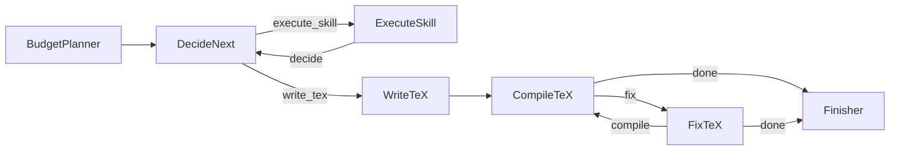

# Nanoscientist

> **Nano. Lean. One loop, one metric, one paper.**

An autonomous research agent that turns a topic into a compiled PDF — within a dollar budget you set. The entire agent is ~4 files, ~7 nodes, ~20 skills. No framework bloat, no orchestration overhead.

Built on [PocketFlow](https://github.com/The-Pocket/PocketFlow). Directly inspired by [karpathy/autoresearch](https://github.com/karpathy/autoresearch): fix the budget, run the loop, let the agent figure out the rest.

## How it works



| Stage | What happens |
|---|---|
| **BudgetPlanner** | Reads the topic + budget, emits a prioritised skill plan |
| **DecideNext** | Picks the next skill or decides the research is deep enough to write |
| **ExecuteSkill** | Loads the skill's `SKILL.md`, runs it via LLM, executes any code blocks, collects BibTeX |
| **WriteTeX** | Synthesises all artifacts into a `.tex` + `.bib` report |
| **CompileTeX** | Runs `pdflatex` + `bibtex` to produce a PDF |
| **FixTeX** | Patches undefined citations or LaTeX errors and recompiles |

**Why nano?** The core is intentionally tiny — 4 source files, ~800 lines total. Each skill is a single markdown file read on demand. No databases, no queues, no config YAML. The budget is the only knob.

Each skill call costs ~$0.005; the final report ~$0.01. The agent runs until the budget is spent, then writes.

## Quickstart

```bash
# 1. Clone
git clone https://github.com/your-org/nanoscientist
cd nanoscientist

# 2. Install dependencies
pip install -r requirements.txt

# 3. Add API keys
cp .env.example .env
# edit .env — at minimum set OPENROUTER_API_KEY

# 4. Run
python main.py "CRISPR off-target effects in primary T cells" --budget 1.00
```

Output lands in `outputs/<task-id>/`:

```
outputs/
└── <uuid>/
    ├── plan.yaml          # skill execution plan
    ├── report.tex         # compiled LaTeX source
    ├── report.pdf         # final PDF (if pdflatex installed)
    ├── references.bib     # deduplicated BibTeX
    ├── artifacts/         # per-skill markdown outputs
    ├── figures/           # generated plots / images
    ├── data/              # collected CSV / JSON data
    ├── scripts/           # executed code blocks
    ├── history.json       # step-by-step execution log
    ├── decisions.json     # DecideNext action log
    └── cost_log.json      # per-step token costs
```

## CLI reference

```
python main.py <topic> [options]

Arguments:
  topic                 Research question (string or path to a .md file)

Options:
  -b, --budget FLOAT    Spend limit in USD  (default: $5.00)
  -o, --output DIR      Output directory    (default: outputs/)
  -e, --env FILE        Path to .env file   (default: .env)
  --list-skills         Print available skills and exit
```

**Budget tiers**

| Budget | Report type | Approx. skill calls |
|---|---|---|
| < $0.10 | Quick Summary | 1–2 |
| $0.10 – $0.50 | Literature Review | 3–6 |
| $0.50 – $2.00 | Research Report | 10–20 |
| $2.00 – $5.00 | Full Paper | 30–50 |
| $5.00+ | Full Paper (exhaustive) | 50+ |

## Skills

Each skill is a folder under `skills/` with a `SKILL.md` that the agent reads at runtime (lazy-loaded — only the active skill is ever in context).

| Skill | What it produces |
|---|---|
| `research-lookup` | Web search summaries + citations via Perplexity Sonar |
| `literature-review` | Thematic synthesis of prior work |
| `hypothesis-generation` | Testable hypotheses grounded in the evidence |
| `statistical-analysis` | Quantitative analysis with executable Python |
| `data-visualization` | Matplotlib/seaborn figures saved to `figures/` |
| `scientific-critical-thinking` | Assumption audits, alternative explanations |
| `peer-review` | Structured critique of the emerging paper |
| `citation-management` | BibTeX deduplication and gap-filling |
| `github-mining` | Code / dataset search across GitHub |
| `tooluniverse` | Hugging Face model and dataset discovery |
| `generate-image` | AI-generated figures via image models |
| `scientific-schematics` | Diagram generation for methods / pipelines |
| `scientific-slides` | Slide deck outline |
| `scientific-writing` | Prose drafting for individual sections |
| `latex-posters` | Conference poster in LaTeX |
| `pptx-posters` | Conference poster as PPTX |
| `paper-2-web` | HTML landing page for the paper |
| `venue-templates` | Journal / conference formatting templates |
| `research-grants` | Grant proposal sections |
| `scholar-evaluation` | Researcher profile and impact assessment |

Skills that require code execution declare `allowed-tools: Bash` in their frontmatter.

## Environment variables

| Variable | Required | Used for |
|---|---|---|
| `OPENROUTER_API_KEY` | **Yes** | Core LLM inference (all nodes) |
| `PERPLEXITY_API_KEY` | Recommended | `research-lookup` real-time web search |
| `ANTHROPIC_API_KEY` | Optional | Claude models via OpenRouter |
| `OPENAI_API_KEY` | Optional | OpenAI models, `paper-2-web` |
| `HF_TOKEN` | Optional | `tooluniverse` (Hugging Face) |
| `GITHUB_TOKEN` | Optional | `github-mining` |
| `GITLAB_TOKEN` | Optional | GitLab access |

Copy `.env.example` and fill in what you have. Skills that need a missing key are automatically excluded from the plan.

## Project layout

```
nanoscientist/
├── main.py              # CLI entry point
├── src/
│   ├── flow.py          # PocketFlow wiring
│   ├── nodes.py         # 7 agent nodes
│   └── utils.py         # LLM client, cost tracking, BibTeX utils
├── skills/              # 20 modular research skills
│   └── <skill-name>/
│       ├── SKILL.md     # instructions read by ExecuteSkill
│       └── scripts/     # optional helper Python scripts
├── docs/
│   └── PAPER_QUALITY_STANDARD.md
├── outputs/             # generated reports (git-ignored)
└── .env                 # API keys (git-ignored)
```

## Adding a skill

1. Create `skills/my-skill/SKILL.md` with a YAML frontmatter block:

```markdown
---
id: my-skill
description: One-line description shown in the planner.
allowed-tools: Bash   # omit if no code execution needed
---

Your skill instructions here. The agent will follow these exactly.
```

2. Add an entry to `skills/skills.json`:

```json
{ "id": "my-skill", "description": "One-line description shown in the planner." }
```

That's it — the planner picks it up automatically on the next run.