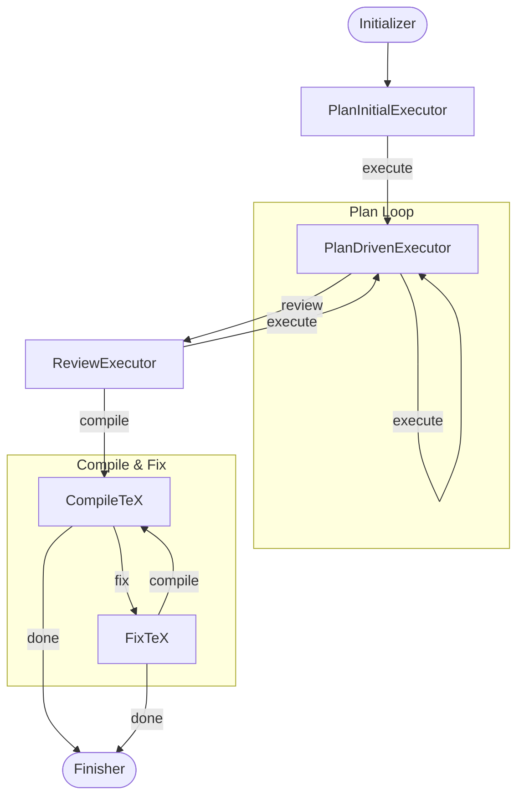

# Nano-scientist

> **Nano. Lean. One plan, one loop, one paper.**


An autonomous research agent that turns a topic into a peer-reviewed technical report — within a dollar budget you set. The entire agent is ~4 files, 7 nodes, 13 skills. No framework bloat, no orchestration overhead.

Built on [PocketFlow](https://github.com/The-Pocket/PocketFlow). Directly inspired by [karpathy/autoresearch](https://github.com/karpathy/autoresearch): fix the budget, run the loops, let the agent figure out the rest.

---

## Showcases

Sample reports generated by Nano-scientist at `--budget 1`:

| Topic | Report |
|---|---|
| Characterize bug patterns in the Lean 4 theorem prover: taxonomy, severity, and resolution trends from GitHub issues | [showcases/1.pdf](showcases/1.pdf) |
| AI agents in nuclear fusion research: applications, recent breakthroughs, and future directions | [showcases/2.pdf](showcases/2.pdf) |

**Lean 4 bug patterns** — Analyzed 1,032 GitHub issues (2021–2026), developed a 15-category taxonomy, and measured resolution trends. Lake/package manager issues dominate (26.5% of labeled bugs); high-severity bugs account for 8.7% of the dataset; monthly reports grew from 1–2 to 24–29 by late 2024.

**AI agents in nuclear fusion** — Surveyed 100+ recent publications on ML applications in tokamak operation. Covers deep reinforcement learning for plasma control, transformer/GNN architectures for disruption prediction, physics-informed neural networks for confinement control, and future directions toward autonomous tokamak operation.

---

## How it works



### Stage breakdown

| Stage | What happens |
|---|---|
| **Initializer** | Infers report type from budget, sets up `outputs/<uuid>/` — zero LLM calls |
| **PlanInitialExecutor** | One LLM call — drafts a typed end-to-end plan: research steps then write steps, one per section |
| **PlanDrivenExecutor** | Loop: pops next pending step → runs `_run_skill` (research) or `_write_section` (write) directly; optionally revises remaining steps based on new findings; exits to review when plan is exhausted |
| **ReviewExecutor** | Assembles the full draft and runs peer-review; appends revision steps to the plan tail and loops back; returns `compile` when accepted |
| **CompileTeX** | Runs `pdflatex` + `bibtex` to produce a PDF — runs **exactly once** |
| **FixTeX** | Patches undefined citations or LaTeX errors and recompiles |
| **Finisher** | Writes `cost_log.json` + `summary.json`, prints total cost |

> **Why nano?** The core is intentionally tiny — 4 source files, ~1,600 lines total. One plan-driven loop replaces the old research + writing loops. The plan is mutable: each completed step can revise what comes next. The budget is the only knob.

---

## Quickstart

```bash
# 1. Clone
git clone https://github.com/AI4Scientist/nano-scientist
cd nano-scientist

# 2. Install dependencies
pip install -r requirements.txt

# 3. Add API keys
cp .env.example .env
# edit .env — at minimum set OPENROUTER_API_KEY

# 4. Run
python main.py "CRISPR off-target effects in primary T cells" --budget 1.00
```

Output lands in `outputs/<uuid>/`:

```
outputs/
└── <uuid>/
    ├── report.tex         # assembled LaTeX source
    ├── report.pdf         # final PDF (if pdflatex installed)
    ├── references.bib     # deduplicated BibTeX
    ├── artifacts/         # per-skill markdown outputs
    ├── figures/           # generated plots / images
    ├── data/              # collected CSV / JSON data
    ├── scripts/           # executed code blocks
    ├── traj.txt           # full stdout trace of the run
    ├── history.json       # step-by-step execution log
    ├── cost_log.json      # per-step token costs
    └── summary.json       # final run summary
```

---

## CLI reference

```
python main.py <topic> [options]

Arguments:
  topic                 Research question (string or path to a .md file)

Options:
  -b, --budget FLOAT    Spend limit in USD  (default: $5.00)
  -o, --output DIR      Output directory    (default: outputs/)
  -e, --env FILE        Path to .env file   (default: .env)
  --list-skills         Print available skills and exit
```

### Budget tiers

Report type is inferred from budget at startup. Actual cost depends on model pricing, skill mix, and how many review/revision cycles occur.

| Budget | Report type | Sections | Notes |
|---|---|---|---|
| < $0.10 | Quick Summary | 4 | 1–2 skill calls; minimal citations |
| $0.10 – $0.50 | Literature Review | 5 | Several skill calls; may exhaust budget before all sections written |
| $0.50 – $2.00 | Research Report | 7 | Typical run with methods + results |
| $2.00 – $5.00 | Full Paper | 8 | Multiple review/revision cycles possible |
| $5.00+ | Full Paper | 8 | Extended research depth; more skills, more citations |

---

## MCP Servers

Skills with `allowed-tools: Bash` automatically see available MCP servers injected into their prompt. Servers are defined in `mcp/mcp.json` and filtered at runtime based on which API keys are set.

| Server | What it provides | Required key |
|---|---|---|
| `arxiv` | Search & fetch academic papers | — |
| `context7` | Library/framework docs lookup | `CONTEXT7_API_KEY` (optional) |
| `deepwiki` | GitHub repo documentation | — |
| `docs-langchain` | LangChain agent-building docs | — |
| `exa` | Neural web search & content retrieval | — |
| `perplexity` | AI-powered web search | `PERPLEXITY_API_KEY` |
| `sequential-thinking` | Chain-of-thought reasoning steps | — |
| `ssh` | Remote command execution over SSH | — |

Add a new server by creating `mcp/<name>.yaml` and adding its entry to `mcp/mcp.json`. The agent picks it up automatically on the next run.

---

## Skills

Each skill is a folder under `skills/` with a `SKILL.md` that the agent reads at runtime (lazy-loaded — only the active skill is ever in context). Skills with `allowed-tools: Bash` get a real tool-calling loop with bash execution and error feedback.

| Skill | What it produces |
|---|---|
| `academic-slides` | Academic slide decks and conference talks: narrative arc, slide structure, visual hierarchy, .pptx generation |
| `evo-memory` | Persistent research memory across cycles: Ideation Memory and Experimentation Memory via IDE/IVE/ESE evolution |
| `experiment-craft` | Debugging and iteration on existing experiments: 5-step diagnostic flow, structured experiment logging |
| `experiment-iterative-coder` | Iterative code refinement via plan→code→evaluate→refine cycles with lint/test scoring |
| `experiment-pipeline` | Structured 4-stage experiment execution: baseline, hyperparameter tuning, proposed method, ablation study |
| `nano-banana` | Professional presentation slides as images via Gemini image generation with browser review and PPTX packaging |
| `paper-navigator` | Find and read academic papers: keyword search, citation traversal, arXiv monitoring, SOTA lookup |
| `paper-planning` | Pre-writing paper planning: story design, experiment planning, figure design, 4-week timeline |
| `paper-rebuttal` | Peer-review rebuttals: score diagnosis, comment prioritization, champion strategy, 18 tactical writing rules |
| `paper-review` | Self-review before submission: 5-aspect checklist, adversarial stress-testing, figure/table quality checks |
| `paper-writing` | Academic paper sections: 11-step workflow with LaTeX templates and section-by-section guidance |
| `research-ideation` | End-to-end ideation: literature grounding, multi-persona generation, ELO ranking, proposal expansion |
| `research-survey` | Structured literature survey reports: outline generation, draft, section expansion, final assembly |

### Adding a skill

1. Create `skills/my-skill/SKILL.md` with a YAML frontmatter block:

```markdown
---
id: my-skill
description: One-line description shown in the planner.
allowed-tools: Bash        # grants real bash tool-calling loop with error feedback
required-keys: [HF_TOKEN]  # skill filtered out at startup if key missing; omit if no key needed
---

Your skill instructions here. The agent will follow these exactly.
```

2. Add an entry to `skills/skills.json`:

```json
{ "id": "my-skill", "description": "One-line description shown in the planner." }
```

That's it — the planner picks it up automatically on the next run. If `required-keys` lists a key that isn't set in `.env`, the skill is silently excluded from the planner rather than failing mid-run.

---

## Environment variables

| Variable | Required | Used for |
|---|---|---|
| `OPENROUTER_API_KEY` | **Required** | Core LLM inference (all nodes) |
| `HF_TOKEN` | Skill-gated | Skills that access Hugging Face Hub |
| `GITHUB_TOKEN` | Skill-gated | Skills that query GitHub repos/issues |
| `OPENAI_API_KEY` | Skill-gated | Skills that use OpenAI-compatible endpoints |

Only `OPENROUTER_API_KEY` is strictly required. Skills whose required key is missing are automatically filtered out at startup — the agent runs with whatever skills are available. Copy `.env.example` to `.env` and set the keys you have.

Optional tuning variables (set in `.env` or shell):

| Variable | Default | Purpose |
|---|---|---|
| `MODEL_NAME` | — | Override the inference model |
| `INFERENCE_BASE_URL` | — | Point to a custom OpenAI-compatible endpoint |
| `INPUT_TOKEN_COST_PER_MILLION` | — | Used to estimate LLM calls remaining |
| `OUTPUT_TOKEN_COST_PER_MILLION` | — | Used to estimate LLM calls remaining |
| `LOOKBACK` | `3` | History steps visible to each node |
| `MAX_REVIEW_ROUNDS` | `1` | How many review/revision cycles to allow |
| `MAX_TOOL_ROUNDS` | `16` | Max bash tool-calling iterations per skill step |

---

## Project layout

```
nano-scientist/
├── main.py              # CLI entry point
├── src/
│   ├── flow.py          # PocketFlow wiring (7 nodes)
│   ├── nodes.py         # 7 agent nodes + module-level helpers
│   └── utils.py         # LLM client, cost tracking, BibTeX utils
├── skills/              # 13 modular research skills
│   ├── skills.json      # skill index (id + description)
│   └── <skill-name>/
│       └── SKILL.md     # instructions + optional YAML frontmatter
├── mcp/                 # MCP server definitions
│   ├── mcp.json         # server registry (loaded at runtime)
│   └── <server>.yaml    # per-server config
├── outputs/             # generated reports (git-ignored)
└── .env                 # API keys (git-ignored)
```

---

## 📌 Citation

If you use Nano-scientist in your research, please cite:

```bibtex
@software{nano_scientist2026,
  title  = {Nano-scientist: Autonomous Research Agent for Budget-Constrained Scientific Reports},
  author = {{AI4Scientist Team}},
  year   = {2026},
  url    = {https://github.com/AI4Scientist/nano-scientist}
}
```
