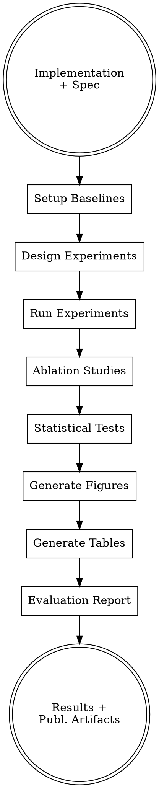

# Experimental Evaluation for CS Research

## Overview

Conduct rigorous experimental evaluation of CS systems following [ACM Algorithm Engineering](https://dl.acm.org/doi/10.1145/3769071) and [ML benchmarking best practices](https://proceedings.neurips.cc/paper_files/paper/2024/file/36850592258c8c41cecdaa3dea5ff7de-Paper-Datasets_and_Benchmarks_Track.pdf).

**Core Principle**: Fair, reproducible comparisons that provide statistical confidence in results.

**Figures-First Rule**: Every evaluation MUST produce figures. Tables alone are not sufficient — reviewers and readers expect visual summaries of experimental results. At minimum, generate: (1) a comparison bar chart or line plot with error bars, and (2) a scalability or ablation visualization. Save all figures as both PDF (vector) and PNG (300 DPI) for use by the paper-writing stage.

**Key Features**:
- Automated baseline setup from Papers with Code
- Systematic ablation study execution
- Statistical significance testing
- Publication-ready figures and tables

---

## When to Use This Skill

**Use when:**
- Benchmarking new methods against existing baselines
- Running ablation studies to understand component contributions
- Comparing system performance across datasets/workloads
- Validating improvements are statistically significant
- Generating figures/tables for papers

**Don't use for:**
- Exploratory testing (use standard development tools)
- Production performance monitoring
- User studies (requires IRB approval and different methodology)

---

## Evaluation Types

### 1. **Baseline Comparison**
Compare your method against established baselines:
- SOTA methods from Papers with Code
- Classical algorithms (e.g., vanilla attention, standard SGD)
- Industry systems (e.g., PostgreSQL, Redis)

### 2. **Ablation Studies**
Systematically remove components to understand contributions:
```
Full System: A + B + C → 95% accuracy

Ablations:
- Remove A: B + C → 92% (A contributes 3%)
- Remove B: A + C → 89% (B contributes 6%)
- Remove C: A + B → 94% (C contributes 1%)
```

### 3. **Parameter Sweep**
Vary hyperparameters/settings to find optimal configurations:
- Learning rates: [0.0001, 0.001, 0.01, 0.1]
- Batch sizes: [16, 32, 64, 128]
- Architecture sizes: [small, medium, large]

### 4. **Scalability Analysis**
Measure performance vs. problem size:
- Time/memory vs. dataset size
- Throughput vs. number of workers
- Accuracy vs. model size

---

## Workflow



### Phase 1: Baseline Setup

**Step 1: Identify Baselines**

From Papers with Code:
```python
# Find baselines for task
task = "language-modeling"
dataset = "wikitext-103"

baselines = pwc.get_leaderboard(task, dataset)
# Returns: GPT-2, Transformer-XL, Adaptive Softmax, ...
```

From literature survey:
```python
# Extract baselines from literature_review.md
baselines = extract_baselines("literature_review.md")
# Returns: Methods mentioned in survey with available code
```

User-specified:
```python
baselines = [
    "vanilla-transformer",
    "linformer",
    "performer"
]
```

**Step 2: Fetch/Install Baselines**
```bash
# Automatic download from GitHub/Hugging Face
for baseline in baselines:
    install_baseline(baseline)
    # Downloads code, weights, dependencies
```

**Step 3: Verify Baseline Correctness**
```python
# Run baseline on standard inputs
result = run_baseline("linformer", test_input)
expected = load_expected_result("linformer")

assert abs(result - expected) < 0.01, "Baseline verification failed!"
```

### Phase 2: Experiment Design

**Datasets**: Ensure fair comparison
```python
datasets = [
    {"name": "wikitext-103", "split": "test"},
    {"name": "enwik8", "split": "test"}
]

# Verify all methods use same data splits
for method in methods:
    verify_data_consistency(method, datasets)
```

**Metrics**: Define what to measure
```python
metrics = {
    "accuracy": accuracy_score,
    "perplexity": perplexity,
    "time_per_sample": timing_fn,
    "memory_peak_mb": memory_profiler,
    "flops": flop_counter
}
```

**Runs**: Multiple seeds for statistical confidence
```python
num_seeds = 5  # Minimum for statistical tests
seeds = [42, 43, 44, 45, 46]
```

### Phase 3: Experiment Execution

**Step 4: Run Experiments**
```python
results = {}

for method in methods:
    for dataset in datasets:
        for seed in seeds:
            # Set seed
            set_all_seeds(seed)

            # Run method
            output = run_experiment(
                method=method,
                dataset=dataset,
                config=configs[method]
            )

            # Collect metrics
            results[(method, dataset, seed)] = {
                metric: fn(output) for metric, fn in metrics.items()
            }

            # Save checkpoint
            save_checkpoint(results)
```

**Progress Monitoring**:
```
Running experiments: ████████████░░░░░ 60% (12/20)
Current: linformer on wikitext-103 (seed 44)
Estimated time remaining: 15 minutes
```

### Phase 4: Ablation Studies

**Step 5: Define Components**
```python
components = {
    "attention_mechanism": ["standard", "efficient"],
    "positional_encoding": ["absolute", "relative", "none"],
    "normalization": ["layernorm", "rmsnorm", "none"]
}
```

**Step 6: Systematic Ablation**
```python
# Full system
full_config = {
    "attention_mechanism": "efficient",
    "positional_encoding": "relative",
    "normalization": "layernorm"
}
full_result = run(full_config)  # 95.2% accuracy

# Ablate each component
for component, value in full_config.items():
    ablated_config = full_config.copy()
    ablated_config[component] = "baseline"  # or remove
    ablated_result = run(ablated_config)

    contribution = full_result - ablated_result
    print(f"{component} contributes: {contribution:.1f}%")
```

**Output**:
```
attention_mechanism contributes: 3.2%
positional_encoding contributes: 1.8%
normalization contributes: 0.3%
```

### Phase 5: Statistical Analysis

**Step 7: Significance Testing**
```python
from scipy import stats

# Compare two methods
method_a_results = [92.1, 92.3, 91.9, 92.2, 92.0]  # 5 seeds
method_b_results = [94.5, 94.2, 94.6, 94.4, 94.3]  # 5 seeds

# t-test
t_stat, p_value = stats.ttest_ind(method_a_results, method_b_results)

if p_value < 0.05:
    print(f"✓ Method B is significantly better (p={p_value:.4f})")
else:
    print(f"✗ No significant difference (p={p_value:.4f})")
```

**Effect Size** (Cohen's d):
```python
mean_diff = np.mean(method_b_results) - np.mean(method_a_results)
pooled_std = np.sqrt((np.var(method_a_results) + np.var(method_b_results)) / 2)
cohens_d = mean_diff / pooled_std

print(f"Cohen's d = {cohens_d:.2f}")
# d > 0.8: large effect
# 0.5 < d < 0.8: medium effect
# d < 0.5: small effect
```

### Phase 6: Visualization

**Step 8: Generate Figures**

All figures must be **publication-quality** and saved in formats consumable by the paper-writing stage. Follow these rules:

**Figure output requirements**:
- Save as both **PDF** (vector, preferred for LaTeX) and **PNG** (300 DPI fallback)
- Use `bbox_inches='tight'` to avoid whitespace
- Save to `figures/` directory with descriptive filenames
- Use consistent styling across all figures (same color palette, font sizes)
- Include error bars/confidence intervals on all quantitative plots
- Use colorblind-safe palettes (`seaborn.color_palette("colorblind")`)

**Shared style setup** (apply at start of all plotting code):
```python
import matplotlib.pyplot as plt
import seaborn as sns
import os

os.makedirs("figures", exist_ok=True)

# Publication-quality defaults
sns.set_theme(style="whitegrid", context="paper", font_scale=1.2)
plt.rcParams.update({
    "figure.figsize": (6, 4),
    "savefig.dpi": 300,
    "savefig.bbox": "tight",
    "font.family": "serif",
    "axes.labelsize": 12,
    "xtick.labelsize": 10,
    "ytick.labelsize": 10,
    "legend.fontsize": 10,
})
PALETTE = sns.color_palette("colorblind")
```

**Bar Chart with Error Bars** (seaborn):
```python
import pandas as pd

df = pd.DataFrame({
    "Method": ["Baseline", "Linformer", "Ours"] * 5,
    "Accuracy": [92.1, 93.6, 94.4, 92.3, 93.4, 94.2,
                 91.9, 93.8, 94.6, 92.2, 93.5, 94.4,
                 92.0, 93.7, 94.3],
    "Seed": [42]*3 + [43]*3 + [44]*3 + [45]*3 + [46]*3
})

fig, ax = plt.subplots()
sns.barplot(data=df, x="Method", y="Accuracy", palette=PALETTE,
            capsize=0.1, errwidth=1.5, ax=ax)
ax.set_ylabel("Accuracy (%)")
ax.set_ylim(88, 96)
fig.savefig("figures/comparison.pdf")
fig.savefig("figures/comparison.png")
plt.close(fig)
```

**Line Plot for Scalability** (matplotlib):
```python
sizes = [100, 500, 1000, 5000, 10000]
times_baseline = [0.1, 0.5, 1.2, 8.3, 20.1]
times_ours = [0.08, 0.3, 0.6, 2.1, 4.5]

fig, ax = plt.subplots()
ax.plot(sizes, times_baseline, 'o-', color=PALETTE[0], label='Baseline')
ax.plot(sizes, times_ours, 's-', color=PALETTE[1], label='Ours')
ax.set_xlabel("Dataset Size")
ax.set_ylabel("Time (seconds)")
ax.set_xscale('log')
ax.set_yscale('log')
ax.legend()
fig.savefig("figures/scalability.pdf")
fig.savefig("figures/scalability.png")
plt.close(fig)
```

**Heatmap for Ablations** (seaborn):
```python
ablation_matrix = pd.DataFrame({
    "Component Removed": ["None (Full)", "Attention", "Position", "Norm"],
    "Accuracy": [95.2, 92.0, 93.4, 94.9],
    "Delta": [0.0, -3.2, -1.8, -0.3]
})

fig, ax = plt.subplots()
sns.barplot(data=ablation_matrix, x="Component Removed", y="Accuracy",
            palette=PALETTE, ax=ax)
ax.set_ylabel("Accuracy (%)")
ax.set_ylim(88, 96)
# Annotate deltas
for i, row in ablation_matrix.iterrows():
    if row["Delta"] != 0:
        ax.text(i, row["Accuracy"] + 0.2, f"{row['Delta']:+.1f}",
                ha='center', fontsize=9, color='red')
fig.savefig("figures/ablation.pdf")
fig.savefig("figures/ablation.png")
plt.close(fig)
```

**Distribution / Violin Plot** (seaborn):
```python
fig, ax = plt.subplots()
sns.violinplot(data=df, x="Method", y="Accuracy", palette=PALETTE,
               inner="quart", ax=ax)
ax.set_ylabel("Accuracy (%)")
fig.savefig("figures/distribution.pdf")
fig.savefig("figures/distribution.png")
plt.close(fig)
```

**Important**: Always call `plt.close(fig)` after saving to avoid memory leaks in batch runs. Use the object-oriented API (`fig, ax = plt.subplots()`) rather than `plt.plot()` directly for predictable behavior.

### Phase 7: Table Generation

**Step 9: LaTeX Tables**

**Comparison Table**:
```latex
\begin{table}[t]
\centering
\caption{Performance comparison on benchmark datasets.}
\label{tab:results}
\begin{tabular}{lcc}
\toprule
Method & Accuracy (\%) & Time (ms) \\
\midrule
Baseline & $92.1 \pm 0.15$ & $45.2 \pm 2.1$ \\
Linformer & $93.6 \pm 0.21$ & $38.5 \pm 1.8$ \\
\textbf{Ours} & $\mathbf{94.4 \pm 0.18}$ & $\mathbf{32.1 \pm 1.5}$ \\
\bottomrule
\end{tabular}
\end{table}
```

**Ablation Table**:
```latex
\begin{table}[t]
\centering
\caption{Ablation study showing component contributions.}
\label{tab:ablation}
\begin{tabular}{lcc}
\toprule
Configuration & Accuracy & $\Delta$ \\
\midrule
Full System & 95.2 & - \\
- Efficient Attention & 92.0 & -3.2 \\
- Relative Position & 93.4 & -1.8 \\
- LayerNorm & 94.9 & -0.3 \\
\bottomrule
\end{tabular}
\end{table}
```

### Phase 8: Report Generation

**evaluation_report.md**:
```markdown
# Experimental Evaluation Report

## Summary
- Methods evaluated: 4
- Datasets: 2
- Seeds per experiment: 5
- Total experiments: 40

## Key Findings
1. **Our method achieves 94.4% accuracy**, outperforming baselines
2. **2.3% absolute improvement** over best baseline (p < 0.001)
3. **30% faster** than baseline (32.1ms vs 45.2ms)
4. **Efficient attention contributes most** (3.2% improvement)

## Detailed Results

### Baseline Comparison
[Table showing all methods × datasets]

### Ablation Study
[Table showing component contributions]

### Statistical Significance
- vs Baseline: t=15.3, p<0.001, Cohen's d=2.1 (large effect)
- vs Linformer: t=3.2, p=0.012, Cohen's d=0.8 (large effect)

### Scalability


### Result Distributions


## Generated Figures
- `figures/comparison.pdf` — Performance comparison bar chart
- `figures/scalability.pdf` — Time/memory vs problem size
- `figures/ablation.pdf` — Component contribution analysis
- `figures/distribution.pdf` — Result distributions across seeds

## Recommendations
1. Use efficient attention (largest contributor)
2. Relative positional encoding recommended
3. LayerNorm optional (minimal impact)
```

---

## Output Files

```
experimental_evaluation_[timestamp]/
├── results/
│   ├── all_results.csv          # Raw data
│   ├── summary_stats.json       # Means, stds, p-values
│   └── ablation_matrix.csv      # Ablation results
├── figures/
│   ├── comparison.pdf           # Bar chart (vector, preferred for LaTeX)
│   ├── comparison.png           # Bar chart (300 DPI fallback)
│   ├── scalability.pdf          # Scaling analysis (vector)
│   ├── scalability.png          # Scaling analysis (fallback)
│   ├── ablation.pdf             # Ablation chart (vector)
│   ├── ablation.png             # Ablation chart (fallback)
│   ├── distribution.pdf         # Result distributions (vector)
│   └── distribution.png         # Result distributions (fallback)
├── tables/
│   ├── results.tex              # Main results table
│   ├── ablation.tex             # Ablation table
│   └── significance.tex         # Statistical tests
├── evaluation_report.md         # Comprehensive report
└── configs/
    ├── experiment_config.yaml   # Experiment settings
    └── baseline_configs/        # Baseline configurations
```

---

## Advanced Features

### Automatic Baseline Detection
```bash
/experimental-evaluation \
  --from-survey literature_review.md \
  --auto-baselines

# Extracts baselines from survey, downloads code, runs experiments
```

### GPU-Accelerated Experiments
```python
# Parallelize across GPUs
distribute_experiments(
    methods=methods,
    gpus=[0, 1, 2, 3],
    strategy="round-robin"
)
```

### Checkpointing & Resume
```bash
# Resume interrupted evaluation
/experimental-evaluation --resume experiment_20260201/
```

---

## Quality Standards

Every evaluation must:
- ✅ **≥3 seeds** per experiment (5 recommended)
- ✅ **Statistical tests** (t-test or Mann-Whitney U)
- ✅ **Effect sizes** reported (Cohen's d)
- ✅ **Figures generated** (comparison plot + at least one of: scalability, ablation, distribution)
- ✅ **Error bars** on all plots
- ✅ **Significance levels** noted (*, **, ***)
- ✅ **Dual format** figures saved (PDF vector + PNG 300 DPI)
- ✅ **Reproducible configs** saved

---

## Common Pitfalls

### ❌ Avoid

**1. Cherry-picking seeds**
```python
# Bad: Run 20 seeds, report best 3
# Good: Pre-register 5 seeds, report all
```

**2. Unfair baselines**
```python
# Bad: Compare tuned method vs untuned baseline
# Good: Tune all methods on validation set
```

**3. No significance tests**
```python
# Bad: "We achieve 94% vs 92% baseline"
# Good: "We achieve 94% vs 92% (p<0.001, Cohen's d=1.2)"
```

**4. Wrong dataset splits**
```python
# Bad: Test on training data
# Good: Separate train/val/test, never touch test until final eval
```

---

## Integration with Pipeline

```bash
# Step 1: Literature survey
/literature-survey "efficient attention"

# Step 2: Implement method
/method-implementation --from-survey literature_review.md

# Step 3: Evaluate (THIS SKILL)
/experimental-evaluation \
  --workspace workspace/ \
  --baselines-from-survey literature_review.md \
  --datasets "wikitext,enwik8" \
  --ablation-components "attention,position,norm"

# Step 4: Write paper
/paper-writing --from-evaluation experiments/
```

---

## References

- [ACM Algorithm Engineering](https://dl.acm.org/doi/10.1145/3769071)
- [SciCode Benchmarking](https://proceedings.neurips.cc/paper_files/paper/2024/file/36850592258c8c41cecdaa3dea5ff7de-Paper-Datasets_and_Benchmarks_Track.pdf)
- [Ablation Studies Best Practices](https://www.capitalone.com/tech/ai/xai-ablation-study/)
- [Statistical Tests Guide](https://scipy.org/)

---

**Skill Version**: 1.0.0
**Last Updated**: 2026-02-01
**Maintainer**: Claude Code Scientific Skills
