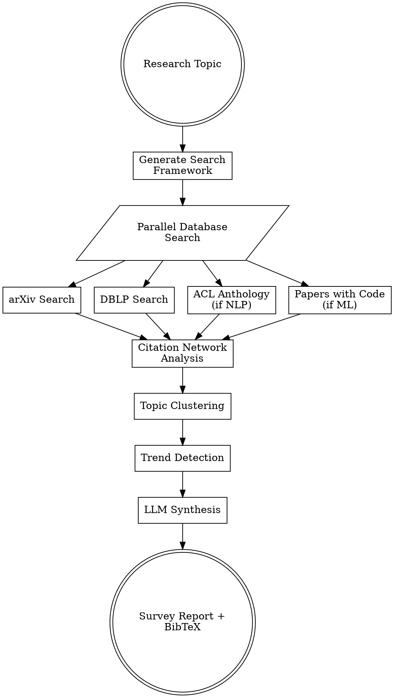

# CS Literature Survey

## Overview

Conduct comprehensive literature surveys for computer science research by searching CS-specific databases, analyzing citation networks, and synthesizing findings into structured reports.

**Core Principle**: Systematic, reproducible literature discovery with verified citations.

**Figures-First Rule**: Every survey MUST produce visualizations. A survey report without figures is incomplete — readers need visual summaries to grasp the landscape. At minimum, generate: (1) a publication timeline showing research volume over time, and (2) a topic distribution chart. Citation network graphs and trend visualizations are strongly encouraged. Save all figures as both PDF and PNG.

**Key Features**:
- CS-specific database search (arXiv, DBLP, ACL Anthology, Papers with Code)
- Citation network analysis (forward/backward citations)
- Trend detection (emerging topics, influential authors)
- Automated report generation with BibTeX and figures

---

## When to Use This Skill

**Use when:**
- Starting a new research project (need to understand state-of-the-art)
- Writing related work section for papers
- Identifying research gaps and opportunities
- Finding baseline methods for comparison
- Tracking developments in a research area

**Don't use for:**
- General web search (use WebSearch)
- Medical/biomedical research (use PubMed-focused tools)
- Patent search (use patent databases)
- Industry blog posts/reports (use web search)

---

## CS-Specific Databases

### 1. **arXiv** (CS preprints)
- Computer Science categories: cs.AI, cs.CL, cs.CV, cs.LG, etc.
- Pre-publication access to latest research
- Fast-moving fields (ML, NLP, CV)
- API: arxiv.org

### 2. **DBLP** (CS bibliography)
- Comprehensive CS publication index
- Venue information (conferences, journals)
- Author disambiguation
- Citation tracking
- API: dblp.org

### 3. **ACL Anthology** (NLP/CL papers)
- All ACL, EMNLP, NAACL, EACL, CoNLL papers
- Full-text search
- BibTeX export
- API: aclanthology.org

### 4. **Papers with Code** (ML with code)
- Papers linked to implementations
- Leaderboards for tasks/datasets
- SOTA tracking
- API: paperswithcode.com

### 5. **Semantic Scholar** (AI-powered search)
- Citation network analysis
- Influential citations
- Research recommendations
- API: semanticscholar.org

---

## Workflow



### Phase 1: Search Framework Generation

**Step 1: LLM-Generated Search Strategy**
```python
prompt = f"""Generate search framework for CS research topic: {topic}

Output JSON:
{{
  "primary_keywords": ["term1", "term2"],
  "secondary_keywords": ["term3", "term4"],
  "cs_subfields": ["cs.AI", "cs.CL"],
  "time_range": "2020-2024",
  "venues": ["NeurIPS", "ICML", "ACL"],
  "exclusions": ["keyword to exclude"]
}}
"""

framework = llm_generate(prompt)
```

### Phase 2: Parallel Database Search

**Step 2: arXiv Search**
```python
import arxiv

# Search by category and keywords
search = arxiv.Search(
    query=f"cat:{category} AND {keywords}",
    max_results=100,
    sort_by=arxiv.SortCriterion.Relevance
)

papers = []
for result in search.results():
    papers.append({
        "title": result.title,
        "authors": [a.name for a in result.authors],
        "abstract": result.summary,
        "arxiv_id": result.entry_id.split("/")[-1],
        "published": result.published,
        "pdf_url": result.pdf_url,
        "categories": result.categories
    })
```

**Step 3: DBLP Search**
```python
import requests

# Search DBLP API
url = "https://dblp.org/search/publ/api"
params = {
    "q": keywords,
    "format": "json",
    "h": 100  # max results
}

response = requests.get(url, params=params)
dblp_results = response.json()["result"]["hits"]["hit"]

for hit in dblp_results:
    info = hit["info"]
    papers.append({
        "title": info["title"],
        "authors": info.get("authors", {}).get("author", []),
        "venue": info.get("venue"),
        "year": info.get("year"),
        "doi": info.get("doi"),
        "url": info.get("url")
    })
```

**Step 4: ACL Anthology (for NLP)**
```python
# Search ACL Anthology
acl_url = "https://aclanthology.org/search/"
params = {"q": keywords}

# Parse results (web scraping or API if available)
acl_papers = search_acl_anthology(keywords)
```

**Step 5: Papers with Code (for ML)**
```python
# Search Papers with Code
pwc_url = "https://paperswithcode.com/api/v1/papers/"
params = {"q": keywords}

response = requests.get(pwc_url, params=params)
pwc_results = response.json()["results"]

for paper in pwc_results:
    papers.append({
        "title": paper["title"],
        "abstract": paper["abstract"],
        "arxiv_id": paper.get("arxiv_id"),
        "github_url": paper.get("url_pdf"),
        "tasks": [t["task"] for t in paper.get("tasks", [])],
        "datasets": [d["dataset"] for d in paper.get("datasets", [])]
    })
```

### Phase 3: Citation Network Analysis

**Step 6: Semantic Scholar Citation Graph**
```python
import requests

def get_citations(paper_id, direction="references"):
    """Get forward or backward citations."""
    url = f"https://api.semanticscholar.org/graph/v1/paper/{paper_id}/{direction}"
    params = {"fields": "title,authors,year,citationCount"}

    response = requests.get(url, params=params)
    return response.json()["data"]

# For each paper, get citation network
for paper in papers:
    paper["references"] = get_citations(paper["id"], "references")
    paper["citations"] = get_citations(paper["id"], "citations")
    paper["influence_score"] = calculate_influence(paper)
```

**Step 7: Citation Ranking**
```python
# Rank papers by influence
ranked_papers = sorted(
    papers,
    key=lambda p: (p["citationCount"], p["influence_score"]),
    reverse=True
)

# Identify seminal papers (highly cited, older)
seminal_papers = [p for p in ranked_papers if p["year"] < 2020 and p["citationCount"] > 100]

# Identify recent influential papers (recent, high citations)
recent_influential = [p for p in ranked_papers if p["year"] >= 2022 and p["citationCount"] > 20]
```

### Phase 4: Topic Clustering

**Step 8: Automatic Topic Discovery**
```python
from sklearn.feature_extraction.text import TfidfVectorizer
from sklearn.cluster import KMeans

# Extract abstracts
abstracts = [p["abstract"] for p in papers]

# TF-IDF vectorization
vectorizer = TfidfVectorizer(max_features=100, stop_words="english")
tfidf_matrix = vectorizer.fit_transform(abstracts)

# K-means clustering
n_clusters = 5
kmeans = KMeans(n_clusters=n_clusters, random_state=42)
clusters = kmeans.fit_predict(tfidf_matrix)

# Assign cluster labels
for i, paper in enumerate(papers):
    paper["cluster"] = int(clusters[i])

# Extract topic keywords for each cluster
cluster_topics = {}
for cluster_id in range(n_clusters):
    cluster_docs = [abstracts[i] for i in range(len(abstracts)) if clusters[i] == cluster_id]
    cluster_text = " ".join(cluster_docs)
    cluster_tfidf = vectorizer.transform([cluster_text])
    top_indices = cluster_tfidf.toarray()[0].argsort()[-10:][::-1]
    cluster_topics[cluster_id] = [vectorizer.get_feature_names_out()[i] for i in top_indices]
```

### Phase 5: Trend Detection

**Step 9: Temporal Analysis**
```python
import pandas as pd
import matplotlib.pyplot as plt

# Convert to DataFrame
df = pd.DataFrame(papers)
df["year"] = pd.to_datetime(df["published"]).dt.year

# Papers per year
yearly_counts = df.groupby("year").size()

# Emerging topics (increasing frequency)
for cluster_id in range(n_clusters):
    cluster_papers = df[df["cluster"] == cluster_id]
    yearly_cluster = cluster_papers.groupby("year").size()

    if yearly_cluster.iloc[-1] > yearly_cluster.iloc[0] * 2:
        print(f"Emerging topic: {cluster_topics[cluster_id][:3]}")

# Trending authors
author_counts = {}
for paper in papers:
    for author in paper["authors"]:
        author_counts[author] = author_counts.get(author, 0) + 1

top_authors = sorted(author_counts.items(), key=lambda x: x[1], reverse=True)[:10]
```

### Phase 6: LLM Synthesis

**Step 10: Structured Report Generation**
```python
prompt = f"""Synthesize literature survey for: {topic}

INPUTS:
- Total papers: {len(papers)}
- Seminal papers: {len(seminal_papers)}
- Recent influential: {len(recent_influential)}
- Identified topics: {list(cluster_topics.values())}
- Trending authors: {[a[0] for a in top_authors[:5]]}

STRUCTURE:
1. **Overview**: What is the research area?
2. **Research Landscape** (MUST include figures):
   - Timeline figure showing publication volume over time
   - Topic distribution figure showing research cluster sizes
3. **Historical Development**: How has the field evolved?
4. **Major Approaches**: Group by identified topics/clusters
5. **Seminal Works**: Key foundational papers
6. **Recent Advances**: State-of-the-art methods (2022-2024)
7. **Research Gaps**: What's missing or underexplored?
8. **Future Directions**: Where is the field heading?

IMPORTANT: Embed generated figures in the report using markdown
image syntax: . A survey report
without figures is incomplete.

OUTPUT FORMAT: Markdown with \\cite{{arxiv_id}} citations
"""

survey_content = llm_generate(prompt, context=papers)
```

### Phase 7: BibTeX Generation

**Step 11: Create Bibliography**
```python
import bibtexparser

bib_entries = []

for paper in papers:
    entry = {
        "ENTRYTYPE": "article" if "journal" in paper else "inproceedings",
        "ID": paper["arxiv_id"] or f"paper{paper['id']}",
        "title": paper["title"],
        "author": " and ".join(paper["authors"]),
        "year": str(paper["year"]),
    }

    if "arxiv_id" in paper:
        entry["eprint"] = paper["arxiv_id"]
        entry["archivePrefix"] = "arXiv"

    if "venue" in paper:
        entry["booktitle"] = paper["venue"]

    if "doi" in paper:
        entry["doi"] = paper["doi"]

    bib_entries.append(entry)

# Write BibTeX file
bib_database = bibtexparser.bibdatabase.BibDatabase()
bib_database.entries = bib_entries

with open("references.bib", "w") as bibfile:
    bibtexparser.dump(bib_database, bibfile)
```

---

## Output Files

```
literature_survey_[timestamp]/
├── literature_review.md        # Comprehensive survey
├── references.bib              # BibTeX citations
├── papers/                     # Downloaded PDFs (optional)
│   ├── 2301.12345.pdf
│   └── ...
├── data/
│   ├── all_papers.json         # Raw paper metadata
│   ├── citation_network.json   # Citation graph
│   ├── clusters.json           # Topic clusters
│   └── trends.json             # Temporal analysis
└── figures/
    ├── timeline.pdf            # Papers over time (vector)
    ├── timeline.png            # Papers over time (300 DPI)
    ├── citation_network.pdf    # Citation graph (vector)
    ├── citation_network.png    # Citation graph (300 DPI)
    ├── topic_distribution.pdf  # Cluster sizes (vector)
    └── topic_distribution.png  # Cluster sizes (300 DPI)
```

---

## Advanced Features

### Citation Network Visualization

All survey figures must be saved as both **PDF** (vector) and **PNG** (300 DPI) for downstream use by the paper-writing stage. Use colorblind-safe palettes.

```python
import networkx as nx
import matplotlib.pyplot as plt
import seaborn as sns
import os

os.makedirs("figures", exist_ok=True)
sns.set_theme(style="whitegrid", context="paper", font_scale=1.1)
PALETTE = sns.color_palette("colorblind")

# Build citation graph
G = nx.DiGraph()

for paper in papers[:50]:  # Top 50 papers
    G.add_node(paper["id"], label=paper["title"][:30])

    for ref in paper.get("references", [])[:10]:
        if ref["paperId"] in [p["id"] for p in papers]:
            G.add_edge(paper["id"], ref["paperId"])

# Compute centrality
pagerank = nx.pagerank(G)
most_central = sorted(pagerank.items(), key=lambda x: x[1], reverse=True)[:10]

# Visualize
fig, ax = plt.subplots(figsize=(10, 8))
pos = nx.spring_layout(G, seed=42)
nx.draw(G, pos, node_size=[pagerank[n]*5000 for n in G.nodes()],
        node_color=PALETTE[0:1]*len(G.nodes()), alpha=0.7,
        with_labels=True, font_size=7, ax=ax)
ax.set_title("Citation Network (node size = PageRank)")
fig.savefig("figures/citation_network.pdf", bbox_inches='tight')
fig.savefig("figures/citation_network.png", dpi=300, bbox_inches='tight')
plt.close(fig)
```

**Timeline visualization** (papers per year by topic cluster):
```python
fig, ax = plt.subplots(figsize=(8, 4))
for cluster_id in range(n_clusters):
    cluster_df = df[df["cluster"] == cluster_id]
    yearly = cluster_df.groupby("year").size()
    ax.plot(yearly.index, yearly.values, 'o-', color=PALETTE[cluster_id],
            label=f"Topic {cluster_id}: {', '.join(cluster_topics[cluster_id][:2])}")
ax.set_xlabel("Year")
ax.set_ylabel("Number of Papers")
ax.legend(fontsize=8, loc="upper left")
fig.savefig("figures/timeline.pdf", bbox_inches='tight')
fig.savefig("figures/timeline.png", dpi=300, bbox_inches='tight')
plt.close(fig)
```

**Topic distribution** (cluster sizes):
```python
cluster_sizes = df["cluster"].value_counts().sort_index()
cluster_labels = [', '.join(cluster_topics[i][:3]) for i in cluster_sizes.index]

fig, ax = plt.subplots(figsize=(8, 4))
sns.barplot(x=cluster_labels, y=cluster_sizes.values, palette=PALETTE, ax=ax)
ax.set_ylabel("Number of Papers")
ax.set_xlabel("Topic Cluster")
plt.xticks(rotation=30, ha='right', fontsize=8)
fig.savefig("figures/topic_distribution.pdf", bbox_inches='tight')
fig.savefig("figures/topic_distribution.png", dpi=300, bbox_inches='tight')
plt.close(fig)
```

### Automatic Baseline Detection

```python
# Extract methods suitable as baselines
baselines = []

for paper in papers:
    # Has code available
    if paper.get("github_url"):
        # High citations or recent SOTA
        if paper["citationCount"] > 50 or (paper["year"] >= 2023 and paper.get("is_sota")):
            baselines.append({
                "name": extract_method_name(paper["title"]),
                "paper": paper["title"],
                "code_url": paper["github_url"],
                "performance": extract_results(paper["abstract"])
            })

# Save for use in experimental-evaluation
with open("baselines.json", "w") as f:
    json.dump(baselines, f, indent=2)
```

### Related Work Generator

```python
# Generate LaTeX for paper's related work section
related_work_latex = f"""
\\section{{Related Work}}

\\subsection{{Seminal Contributions}}
{generate_paragraph(seminal_papers, "seminal")}

\\subsection{{Recent Approaches}}
{generate_paragraph(recent_influential, "recent")}

\\subsection{{Comparison to Our Work}}
Our approach differs from prior work in the following ways:
{generate_comparison(papers, our_method)}
"""

with open("related_work.tex", "w") as f:
    f.write(related_work_latex)
```

---

## Quality Standards

Every survey must:
- ✅ **≥50 papers** reviewed (100+ for comprehensive surveys)
- ✅ **Multiple databases** searched (not just arXiv)
- ✅ **Citation networks** analyzed (find seminal works)
- ✅ **Verified citations** (no hallucinations)
- ✅ **BibTeX exported** (ready for papers)
- ✅ **Temporal trends** identified (emerging topics)
- ✅ **Figures generated** (timeline + topic distribution, at minimum)
- ✅ **Dual format** figures saved (PDF vector + PNG 300 DPI)

---

## Common Pitfalls

### ❌ Avoid

**1. Single Database Search**
```python
# Bad: Only search arXiv
papers = search_arxiv(keywords)

# Good: Search multiple CS databases
papers = (
    search_arxiv(keywords) +
    search_dblp(keywords) +
    search_acl(keywords) +
    search_pwc(keywords)
)
```

**2. Keyword-Only Search**
```python
# Bad: Simple keyword match
papers = search("neural networks")

# Good: Structured search with categories and filters
papers = search(
    keywords="neural networks",
    categories=["cs.LG", "cs.AI"],
    date_range="2020-2024",
    min_citations=10
)
```

**3. Ignoring Citation Networks**
```python
# Bad: Treat papers as independent
for paper in papers:
    summarize(paper)

# Good: Analyze citation relationships
citation_graph = build_citation_network(papers)
seminal_papers = find_highly_cited(citation_graph)
```

**4. No Temporal Analysis**
```python
# Bad: Mixed old and new papers without context
survey = summarize_all_papers(papers)

# Good: Separate historical vs recent
survey = {
    "foundations": papers_before(2015),
    "modern_approaches": papers_between(2015, 2020),
    "recent_advances": papers_after(2020)
}
```

---

## Examples

### Example 1: ML Paper Survey
```bash
/literature-survey \
  "efficient transformer attention mechanisms" \
  --databases "arxiv,pwc" \
  --categories "cs.LG,cs.CL" \
  --date-range "2020-2024" \
  --max-results 100

# Output: literature_review.md with:
# - Linear attention methods
# - Sparse attention patterns
# - Low-rank approximations
# + BibTeX + citation analysis
```

### Example 2: Systems Paper Survey
```bash
/literature-survey \
  "distributed key-value stores consistency" \
  --databases "dblp" \
  --venues "OSDI,SOSP,NSDI,ATC" \
  --date-range "2015-2024"

# Output: Survey of consensus algorithms, replication strategies
```

### Example 3: NLP Survey
```bash
/literature-survey \
  "large language model reasoning" \
  --databases "arxiv,acl,pwc" \
  --categories "cs.CL,cs.AI" \
  --include-code  # Only papers with code

# Output: Survey + baseline methods for evaluation
```

---

## Integration with Pipeline

```bash
# Step 1: Literature survey (THIS SKILL)
/literature-survey "efficient attention mechanisms"

# Step 2: Implement method from survey insights
/method-implementation --from-survey literature_review.md

# Step 3: Evaluate against baselines from survey
/experimental-evaluation \
  --workspace workspace/ \
  --baselines-from-survey literature_review.md

# Step 4: Write paper with related work from survey
/paper-writing \
  --venue neurips \
  --from-survey literature_review.md \
  --from-implementation workspace/ \
  --from-evaluation experiments/
```

---

## References

- [arXiv API Documentation](https://arxiv.org/help/api)
- [DBLP API Guide](https://dblp.org/faq/How+to+use+the+dblp+search+API.html)
- [ACL Anthology](https://aclanthology.org/)
- [Papers with Code API](https://paperswithcode.com/api/v1/docs/)
- [Semantic Scholar API](https://api.semanticscholar.org/)
- [Systematic Review Methodology](https://www.cochrane.org/about-us/evidence-based-health-care)

---

**Skill Version**: 1.0.0
**Last Updated**: 2026-02-01
**Maintainer**: Claude Code Scientific Skills
