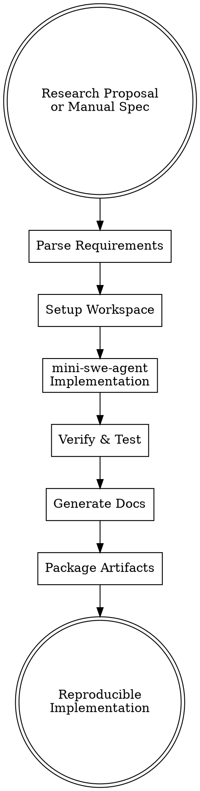

# Method Implementation with Reproducibility

## Overview

Implement CS research methods, systems, and algorithms with **full reproducibility** following best practices from [SciRep Framework 2024](https://arxiv.org/html/2503.07080v2) and [ACM Reproducibility Guidelines](https://www.acm.org/publications/policies/artifact-review-and-badging-current).

**Core Principle**: Every implementation must be **fully reproducible** - anyone should be able to rebuild the environment, rerun the experiments, and obtain the same results.

**Key Innovation**: Uses **mini-swe-agent** with enhanced SWE-agent-style system prompts (inspired by config.yaml from mini-researcher-agent) to generate high-quality implementations, not empty placeholder code.

---

## When to Use This Skill

**Use when:**
- Implementing algorithms from research proposals or papers
- Building systems/prototypes for CS research papers
- Creating reproducible experimental pipelines
- Converting pseudocode/theory to working implementations
- Setting up baselines for comparative studies

**Don't use for:**
- Production software development (use proper SDLC)
- Quick prototyping without reproducibility needs
- Modifying existing mature codebases (use standard development)

---

## Reproducibility Requirements

Every implementation generates:

### 1. **Environment Specification**
- **Dockerfile**: Complete environment definition
- **requirements.txt**: Python dependencies with pinned versions
- **environment.yml**: Conda environment (if applicable)
- **system_info.txt**: Hardware/OS specifications

### 2. **Provenance Tracking**
- **provenance.json**: Experiment metadata
  - Git commit hash
  - Random seeds
  - Configuration parameters
  - Timestamp and environment hash

### 3. **Documentation**
- **README_reproducibility.md**: Step-by-step reproduction guide
- **IMPLEMENTATION_NOTES.md**: Design decisions and trade-offs
- **API.md**: Function/class documentation

### 4. **Verification**
- **tests/**: Unit and integration tests
- **verify_setup.sh**: Environment verification script
- **reproducibility_check.py**: Validate experiment repeatability

---

## Workflow



### Phase 1: Requirements Parsing

**Input Sources**:
1. **research_proposal.md** (from `literature-survey`)
2. **Manual specification** (user provides design doc)
3. **Paper PDF** (extract method section)

**Extracted Information**:
- **Hypotheses to test**
- **Algorithms to implement**
- **Data structures needed**
- **Performance requirements**
- **Success metrics**
- **Required dependencies**

### Phase 2: Workspace Setup

**Step 1: Create Directory Structure**
```
workspace/
├── src/                    # Source code
│   ├── __init__.py
│   └── main.py            # Entry point
├── tests/                  # Test suite
│   ├── test_unit.py
│   └── test_integration.py
├── data/                   # Input data (gitignored if large)
├── outputs/                # Results, figures, logs
├── configs/                # Experiment configurations
│   └── default.yaml
├── Dockerfile              # Environment definition
├── requirements.txt        # Python dependencies
├── README_reproducibility.md
├── provenance.json         # Experiment metadata
└── verify_setup.sh         # Environment check script
```

**Step 2: Initialize Provenance Tracking**
```json
{
  "experiment_id": "exp_20260201_143022",
  "created_at": "2026-02-01T14:30:22Z",
  "git_commit": "a3f5c21",
  "git_branch": "main",
  "git_remote": "https://github.com/user/repo",
  "python_version": "3.11.5",
  "system": {
    "os": "Linux-5.15.0",
    "platform": "x86_64",
    "cpu_count": 16,
    "memory_gb": 64
  },
  "random_seeds": {
    "numpy": 42,
    "torch": 42,
    "random": 42
  },
  "dependencies": {
    "torch": "2.1.0",
    "numpy": "1.24.3",
    "...": "..."
  }
}
```

**Step 3: Generate Dockerfile**
```dockerfile
FROM python:3.11-slim

# Install system dependencies
RUN apt-get update && apt-get install -y \
    git \
    build-essential \
    && rm -rf /var/lib/apt/lists/*

WORKDIR /workspace

# Copy and install Python dependencies
COPY requirements.txt .
RUN pip install --no-cache-dir -r requirements.txt

# Copy source code
COPY src/ ./src/
COPY configs/ ./configs/
COPY tests/ ./tests/

# Set environment variables
ENV PYTHONUNBUFFERED=1
ENV OMP_NUM_THREADS=1

# Default command
CMD ["python", "src/main.py"]
```

### Phase 3: Implementation via mini-swe-agent

**Critical Enhancement**: Use **SWE-agent-style system prompts** (not the weak prompts from old Stage 2).

**System Prompt Structure** (inspired by config.yaml):
```
You are an expert software engineer implementing CS research methods.

TASK:
{task_description}

WORKFLOW:
1. Read and understand the research proposal/specification
2. Design the implementation architecture
3. Implement core algorithms with proper documentation
4. Add comprehensive error handling
5. Create unit tests for each component
6. Generate integration tests
7. Document API and usage examples

CONSTRAINTS:
- Use type hints for all functions
- Add docstrings (Google style)
- Include complexity analysis in comments
- Handle edge cases explicitly
- Log important steps for debugging
- Use descriptive variable names

REQUIRED OUTPUTS:
1. src/main.py - Entry point with CLI
2. src/core.py - Core algorithm implementation
3. tests/test_*.py - Comprehensive test suite
4. README_reproducibility.md - Usage guide

THOUGHT PROCESS:
Before each implementation decision, explain:
- Why this approach?
- What are the trade-offs?
- How does this match the paper/spec?

SUCCESS CRITERIA:
- All tests pass
- Code runs without errors
- Matches specification requirements
- Properly documented
```

**Agent Configuration**:
```python
from minisweagent.agents.default import DefaultAgent
from minisweagent.models.litellm_model import LitellmModel
from minisweagent.environments.local import LocalEnvironment

agent = DefaultAgent(
    LitellmModel(model_name="anthropic/claude-sonnet-4"),
    LocalEnvironment(cwd=str(workspace_path)),
    step_limit=100,  # More steps than old Stage 2 (was 50)
    cost_limit=5.0,  # Higher budget for quality
)

# Enhanced task prompt
task = construct_enhanced_prompt(proposal, spec)
exit_status, result = agent.run(task)
```

**Why This Works Better Than Old Stage 2**:
- ✅ **Explicit workflow steps** (old: vague "implement experiments")
- ✅ **Concrete success criteria** (old: none)
- ✅ **THOUGHT process requirement** (old: agent doesn't explain decisions)
- ✅ **Higher step/cost limits** (old: 50 steps wasn't enough)
- ✅ **Required outputs specification** (old: agent didn't know what to create)

### Phase 4: Verification & Testing

**Step 1: Environment Verification**
```bash
#!/bin/bash
# verify_setup.sh

echo "Verifying reproducibility setup..."

# Check Python version
python --version | grep "3.11" || { echo "Wrong Python version"; exit 1; }

# Check dependencies
pip freeze > installed.txt
diff requirements.txt installed.txt || { echo "Dependency mismatch"; exit 1; }

# Check git status
git status --porcelain | grep -q . && { echo "Warning: Uncommitted changes"; }

# Run tests
pytest tests/ || { echo "Tests failed"; exit 1; }

echo "✓ Setup verified"
```

**Step 2: Reproducibility Check**
```python
# reproducibility_check.py
import subprocess
import json

def run_experiment(seed):
    """Run experiment with specific seed."""
    cmd = ["python", "src/main.py", "--seed", str(seed)]
    result = subprocess.run(cmd, capture_output=True, text=True)
    return json.loads(result.stdout)

# Test reproducibility
results = [run_experiment(42) for _ in range(3)]
assert all(r == results[0] for r in results), "Non-reproducible results!"
print("✓ Reproducibility verified")
```

### Phase 5: Documentation Generation

**README_reproducibility.md**:
```markdown
# Reproducible Implementation: [Method Name]

## Quick Start

### Using Docker (Recommended)
```bash
docker build -t method-impl .
docker run method-impl
```

### Local Setup
```bash
python -m venv venv
source venv/bin/activate
pip install -r requirements.txt
python src/main.py
```

## Reproducing Experiments

### Experiment 1: [Name]
```bash
python src/main.py --config configs/exp1.yaml --seed 42
```

Expected output:
```
Metric A: 0.95 ± 0.02
Metric B: 142.3 ± 5.1
```

### Experiment 2: [Name]
```bash
python src/main.py --config configs/exp2.yaml --seed 42
```

## System Requirements
- Python 3.11+
- 8GB RAM minimum
- GPU optional (CPU fallback available)
- ~2GB disk space

## Verification
```bash
bash verify_setup.sh
python reproducibility_check.py
```

## Troubleshooting
[Common issues and solutions]

## Citation
If you use this implementation, please cite:
[BibTeX entry]
```

### Phase 6: Artifact Packaging

**Output Structure**:
```
method_implementation_[timestamp]/
├── workspace/              # Complete implementation
│   ├── src/
│   ├── tests/
│   ├── configs/
│   ├── Dockerfile
│   └── ...
├── provenance.json         # Full metadata
├── README_reproducibility.md
├── IMPLEMENTATION_NOTES.md
├── verification_report.txt # Test results
└── docker_image.tar        # Optional: Saved Docker image
```

---

## Advanced Features

### Multi-Language Support

**Python** (default):
```python
# Automatic dependency tracking with pip
# Virtual environment management
# pytest for testing
```

**C++**:
```cpp
// CMakeLists.txt generation
// vcpkg for dependencies
// Google Test for testing
```

**Rust**:
```rust
// Cargo.toml with pinned versions
// cargo test for testing
```

**Julia**:
```julia
# Project.toml with dependencies
# Julia test framework
```

### Provenance Tracking Levels

**Level 1: Basic** (default)
- Dependencies, seeds, timestamps

**Level 2: Detailed**
- + Git info, system specs, command history

**Level 3: Full**
- + Input data checksums, intermediate outputs, full logs

### Integration with Experiment Tracking

**MLflow**:
```python
import mlflow

mlflow.start_run()
mlflow.log_params(config)
mlflow.log_metrics(results)
mlflow.log_artifacts("outputs/")
mlflow.end_run()
```

**Weights & Biases**:
```python
import wandb

wandb.init(project="method-impl", config=config)
wandb.log(results)
wandb.save("outputs/*")
```

---

## Quality Standards

Every implementation must:
- ✅ **Compile/run without errors**
- ✅ **Pass all tests** (≥80% code coverage)
- ✅ **Reproduce results** (±5% variance across runs)
- ✅ **Document API** (all public functions)
- ✅ **Include examples** (≥3 usage examples)
- ✅ **Verify environment** (verify_setup.sh passes)

---

## Common Pitfalls

### ❌ Avoid These Mistakes

**1. Incomplete Dependencies**
```python
# Bad: "pip install torch" (version unspecified)
# Good: "torch==2.1.0+cu118" (pinned with CUDA version)
```

**2. Missing Random Seeds**
```python
# Bad: No seed setting
# Good:
import random, numpy as np, torch
random.seed(42)
np.random.seed(42)
torch.manual_seed(42)
```

**3. Hardcoded Paths**
```python
# Bad: "/home/user/data/input.txt"
# Good: Path(__file__).parent / "data" / "input.txt"
```

**4. No Error Handling**
```python
# Bad: Crash on missing file
# Good:
if not data_file.exists():
    raise FileNotFoundError(f"Missing: {data_file}")
```

---

## Examples

### Example 1: Algorithm Implementation
```bash
/method-implementation \
  --from-proposal research_proposal.md \
  --language python \
  --frameworks "numpy,scipy" \
  --provenance-level detailed

# Output: Workspace with algorithm + tests + Docker
```

### Example 2: ML System
```bash
/method-implementation \
  --from-paper "attention_paper.pdf" \
  --language python \
  --frameworks "pytorch,transformers" \
  --gpu-required \
  --experiment-tracking mlflow

# Output: PyTorch implementation with MLflow integration
```

### Example 3: Systems Implementation
```bash
/method-implementation \
  --from-design system_design.md \
  --language rust \
  --performance-critical \
  --provenance-level full

# Output: Rust implementation with benchmarking
```

---

## Integration with Pipeline

**Typical workflow**:
```bash
# Step 1: Literature survey (identify method)
/literature-survey "efficient attention"

# Step 2: Implement method
/method-implementation --from-survey literature_review.md

# Step 3: Evaluate
/experimental-evaluation --workspace workspace/

# Step 4: Write paper
/paper-writing --from-artifacts workspace/
```

---

## Technical Details

### Docker Image Optimization
- Multi-stage builds for smaller images
- Layer caching for faster rebuilds
- .dockerignore for unnecessary files

### Dependency Management
```python
# Generate requirements.txt with exact versions
pip freeze > requirements.txt

# Or use pipreqs for minimal deps
pipreqs src/ --force
```

### Git Integration
```bash
# Auto-commit implementation
git add workspace/
git commit -m "feat: implement [method] with reproducibility artifacts"
git tag exp-v1.0
```

---

## Troubleshooting

### Issue: "mini-swe-agent produces empty code"
**Solution**: Check system prompt - ensure it has:
- Clear workflow steps
- Concrete success criteria
- Required outputs specification
- Increase step_limit to 100+

### Issue: "Tests fail in Docker but pass locally"
**Solution**: Environment mismatch
- Check Python versions match
- Verify system dependencies in Dockerfile
- Use `docker run -it` to debug interactively

### Issue: "Results not reproducible"
**Solution**: Missing randomness control
- Set all library seeds (numpy, torch, random)
- Fix data shuffle seeds
- Disable non-deterministic operations

---

## Related Skills

- **literature-survey**: Find methods to implement
- **experimental-evaluation**: Benchmark implementations
- **paper-writing**: Document implementations in papers

---

## References

- [SciRep Reproducibility Framework](https://arxiv.org/html/2503.07080v2)
- [ACM Artifact Review Guidelines](https://www.acm.org/publications/policies/artifact-review-and-badging-current)
- [Docker Best Practices](https://docs.docker.com/develop/dev-best-practices/)
- [Software Carpentry](https://software-carpentry.org/)

---

**Skill Version**: 1.0.0
**Last Updated**: 2026-02-01
**Maintainer**: Claude Code Scientific Skills
