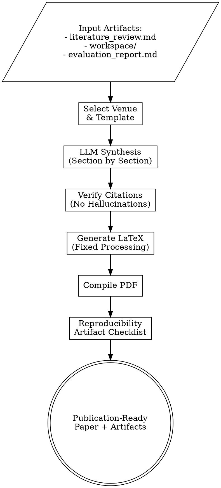

# CS Paper Writing for Top Venues

## Overview

Generate publication-ready CS papers for top-tier venues (NeurIPS, ICML, ICLR, ACL, AAAI, OSDI, CHI) by synthesizing content from research artifacts: literature surveys, implementations, and experimental evaluations.

**Core Principle**: Produce complete, technically accurate drafts that serve as strong starting points for human refinement.

**Figures-First Rule**: Every paper MUST include figures. A paper without figures is incomplete. Use TikZ diagrams to illustrate method/architecture and pgfplots or experiment-generated plots for results. Figures communicate faster than text — reviewers skim figures before reading prose. At minimum, every paper needs: (1) a method/architecture diagram, and (2) a results visualization.

**Critical Rule**: **NEVER hallucinate citations.** Every reference must be verified programmatically.

---

## Supported Venues

### Machine Learning
- **NeurIPS**: Neural Information Processing Systems (A*)
- **ICML**: International Conference on Machine Learning (A*)
- **ICLR**: International Conference on Learning Representations (A*)
- **AISTATS**: AI and Statistics (A)

### Natural Language Processing
- **ACL**: Association for Computational Linguistics (A*)
- **EMNLP**: Empirical Methods in NLP (A*)
- **NAACL**: North American Chapter of ACL (A)
- **COLM**: Conference on Language Modeling

### Computer Vision
- **CVPR**: Computer Vision and Pattern Recognition (A*)
- **ICCV**: International Conference on Computer Vision (A*)
- **ECCV**: European Conference on Computer Vision (A*)

### Systems
- **OSDI**: Operating Systems Design and Implementation (A*)
- **SOSP**: Symposium on Operating Systems Principles (A*)
- **NSDI**: Networked Systems Design (A*)
- **ATC**: USENIX Annual Technical Conference (A)

### Human-Computer Interaction
- **CHI**: Computer-Human Interaction (A*)
- **UIST**: User Interface Software and Technology (A*)

---

## Workflow



### Phase 1: Artifact Collection

**Read Input Files**:
```python
# Literature survey
literature = read_markdown("literature_review.md")
related_work = extract_related_work(literature)
citations = extract_citations(literature)

# Implementation
workspace = read_workspace("workspace/")
method_description = extract_method(workspace / "README.md")
code_url = get_repo_url(workspace)

# Evaluation
evaluation = read_markdown("evaluation_report.md")
results_tables = extract_tables(evaluation)
figures = list((evaluation.parent / "figures").glob("*.png"))
```

### Phase 2: Venue Selection & Template

**User Selects Venue**:
```bash
/paper-writing --venue neurips --from-artifacts ./
```

**Load Template**:
```python
template = load_template(venue="neurips")
# Returns: LaTeX template, page limits, formatting rules
```

**Venue-Specific Requirements**:
| Venue | Page Limit | Anonymity | Review Platform | Code Required |
|-------|------------|-----------|-----------------|---------------|
| NeurIPS | 9 + refs | Double-blind (anonymous) | OpenReview | Encouraged |
| ICML | 8 + refs | Double-blind (anonymous) | OpenReview | Encouraged |
| ICLR | Varies | Double-blind (anonymous) | OpenReview | Encouraged |
| ACL | 8 + refs | Double-blind (anonymous) | OpenReview | Yes (reproducibility) |
| OSDI | 12 + refs | Single-blind | HotCRP | Required |

**Default**: All papers use anonymous authors (`\author{Anonymous Author(s)}`) for review-ready submission.

### Phase 3: LLM-Powered Synthesis

**Enhanced Prompt**:
```python
prompt = f"""You are an expert academic researcher writing a {venue} paper.

CRITICAL REQUIREMENTS:
1. **No Citation Hallucinations**: Only use citations from the provided list
2. **Technical Accuracy**: Match method descriptions to implementation
3. **Quantitative Results**: Include all experimental numbers
4. **Complexity Analysis**: Provide Big-O notation where relevant
5. **Code Availability**: Mention reproducibility artifacts
6. **Anonymous Submission**: This paper is for double-blind peer review
   (e.g., OpenReview). Use "Anonymous Author(s)" for authorship.
   Do NOT include author names, affiliations, acknowledgments that
   reveal identity, or self-citations that de-anonymize (e.g., replace
   "our prior work [OurName2024]" with "prior work [Anonymous]" or
   cite in third person). Do NOT include a \\thanks{{}} field.

WRITING QUALITY REQUIREMENTS (MANDATORY — read carefully):

You are writing a SCIENTIFIC PAPER, not a technical report or user manual.
Every section must read as connected, argumentative prose.

**Prose-First Rule**: Write in flowing paragraphs. Each paragraph should
have a topic sentence, develop an argument, and transition to the next.
Bullet points and numbered lists are FORBIDDEN except in these cases:
  - A "Contributions" list in the Introduction (max 3-4 items)
  - Algorithm pseudocode (use \\begin{{algorithm}} environment)
  - Items in a formal table
Lists must NEVER replace paragraph prose for explanations, observations,
interpretations, discussions, or proof steps.

**Narrative Flow**: The paper must tell a coherent story:
  - Introduction: Set up the question, build tension ("Can we do better?"),
    then resolve it with your contribution. End with a brief roadmap sentence,
    NOT a subsection called "Paper Organization."
  - Each section must open by connecting to what came before and close by
    motivating what comes next.
  - Avoid mechanical transitions ("The remainder of this paper is organized
    as follows. Section 2 does X. Section 3 does Y."). Instead, weave the
    roadmap into the narrative naturally.

**Proof Writing**: Mathematical proofs MUST be written as continuous
reasoning in paragraph form, not as numbered step lists. Use words like
"observe that," "it follows that," "since," "by combining" to connect
logical steps. Reserve \\begin{{enumerate}} for definitions with multiple
formal conditions, not for proof steps.

**Result Interpretation**: When discussing experimental results, do NOT
produce a numbered list of "Key Observations." Instead, write paragraphs
that interpret the data, explain WHY results look the way they do, connect
findings to the theoretical claims, and note surprises or confirmations.
Weave table/figure references into the prose naturally.

**Discussion Section**: Must synthesize and argue, not list. Each paragraph
should develop one insight in depth — its implication, its connection to
prior work, its limitations. Never write a subsection that is just a
bulleted list of points.

**Section Naming**: Use descriptive names that convey content. Avoid
generic headings like "Main Results" or "Implications." Prefer headings
that hint at the finding, e.g., "MergeSort Achieves the Information-
Theoretic Bound" or "Limitations of the Comparison Model."

**Sentences and Paragraphs**:
  - Vary sentence length. Mix short declarative sentences with longer
    ones that develop nuance.
  - Each paragraph should be 4-8 sentences. Single-sentence paragraphs
    are almost always wrong in a paper.
  - Avoid starting consecutive sentences with the same word.
  - Do not use bold text inside running prose to label sub-points
    (e.g., "\\textbf{{Tightness}}: MergeSort achieves..."). This is
    a disguised list. Write a real paragraph instead.

**What NOT to Write**:
  - "The significance of this result cannot be overstated:" followed by
    a list. → Write a paragraph explaining WHY it matters.
  - "This paper makes the following contributions:" followed by 5 items
    with bold labels. → Keep the list short (3-4 items), one line each,
    no bold-label-colon pattern.
  - "Key Observations:" followed by numbered items. → Write paragraphs.
  - Subsections that contain only a single list and nothing else.
  - "Future Work" as a numbered list of topics. → Write a paragraph
    discussing the most promising 2-3 directions with reasoning.

**Eliminating Redundancy** (CRITICAL — this is the second most common
failure after list-itis):

A paper is NOT a set of independent sections that each summarize the
whole story. Each section has ONE job. Content that appears in one
section must NOT be restated in another. Apply these rules:

  - The paper's main claim should be stated precisely ONCE (in the
    theorem or central result). The abstract and introduction may
    preview it, and the conclusion may echo it, but each must use
    DIFFERENT framing and emphasis — not the same sentence repeated.
  - Do NOT create a "Contributions" subsection AND a "Distinction from
    Prior Work" subsection AND a conclusion that re-lists contributions.
    State contributions once in the introduction. The related work
    section should position your work via contrast with prior work, not
    re-enumerate your contributions. The conclusion should reflect on
    significance, not re-list.
  - Do NOT create a "Motivation and Significance" subsection that
    restates the introduction's opening paragraphs. The introduction
    IS the motivation. Fold significance into the narrative.
  - The Discussion section must add NEW insight — synthesis, implication,
    connection to broader context — NOT recap what Results already showed.
    If a Discussion subsection merely summarizes a table from Experiments,
    delete it.
  - Each table must present information not derivable by simple arithmetic
    from another table. Do not include both a raw-counts table and a
    ratios table if the ratios are just column A / column B. Pick the
    more informative one, or add a ratio column to the original table.
  - Technical details (e.g., Stirling's approximation, non-comparison
    sorting examples) should appear in ONE place with cross-references
    elsewhere, not be re-explained in multiple sections.
  - Before writing any subsection, ask: "Does this add information or
    argument that does not appear elsewhere in the paper?" If not, merge
    it into an existing section or delete it.

**Section-by-Section Redundancy Test**: After drafting, verify:
  - Abstract: previews the story (unique framing)
  - Introduction: motivates + states contributions (the ONE place)
  - Related Work: positions against literature (no re-listing of contributions)
  - Method: presents the approach (technical details live here)
  - Experiments: presents evidence (tables + interpretation)
  - Discussion: synthesizes NEW insights (not recap)
  - Conclusion: reflects on significance (different angle from introduction)

If any two sections say the same thing in the same way, one of them must
be rewritten or removed.

INPUT ARTIFACTS:
- Literature Survey: {related_work[:3000]}
- Method Implementation: {method_description}
- Experimental Results: {results_summary}
- Available Citations: {citation_keys}

PAPER STRUCTURE (for {venue}):

Abstract (250 words): State the problem, the approach, and the key
quantitative result — all in a single flowing paragraph.

Introduction: Motivate the problem, situate it in the literature, state
your contribution clearly, and preview the paper structure in one sentence.

Related Work: Group by intellectual themes. For each theme, write a
paragraph synthesizing multiple papers and explaining how your work
differs. Do not list papers one by one.

Method: Describe the approach as a narrative. Use formal definitions,
theorems, and proofs in paragraph form. Include pseudocode via the
algorithm environment when helpful, but surround it with explanatory
prose.

Experiments: Describe setup in prose. Present results with tables and
figures, but interpret them in paragraphs — do not just list observations.

Discussion: Synthesize insights, connect back to the introduction's
question, discuss limitations honestly in prose paragraphs.

Conclusion: A concise paragraph summarizing the contribution and its
significance. No lists.

OUTPUT FORMAT:
Generate valid JSON with sections:
{{
  "title": "Concise Paper Title",
  "abstract": "...",
  "sections": [
    {{"name": "Introduction", "content": "..."}},
    ...
  ]
}}

IMPORTANT:
- Use \\cite{{refX}} for citations (keys: {citation_keys})
- Include \\begin{{algorithm}} blocks for pseudocode
- NO markdown formatting (use LaTeX commands)
- NO \\begin{{itemize}} or \\begin{{enumerate}} except for the contributions
  list in the introduction and formal definitions

FIGURE AND TABLE CROSS-REFERENCE RULES (MANDATORY):
Every \\ref must have a matching \\label, and vice versa. Broken
cross-references (producing "??" in the PDF) are unacceptable.

1. **Label placement**: \\label MUST come AFTER \\caption inside every
   figure/table environment. Placing \\label before \\caption produces
   wrong numbering. Correct order:
   \\begin{{table}}[h]
     \\centering
     \\begin{{tabular}}...\\end{{tabular}}
     \\caption{{Description here.}}
     \\label{{tab:my_table}}
   \\end{{table}}

2. **Naming convention**: Use prefixes consistently:
   - Tables: \\label{{tab:name}} and \\ref{{tab:name}}
   - Figures: \\label{{fig:name}} and \\ref{{fig:name}}
   - Algorithms: \\label{{alg:name}} and \\ref{{alg:name}}
   - Equations: \\label{{eq:name}} and \\ref{{eq:name}}
   - Sections: \\label{{sec:name}} and \\ref{{sec:name}}

3. **No dangling references**: Before finalizing, verify that EVERY
   \\ref{{X}} in the text has a corresponding \\label{{X}} defined
   somewhere in the document. Do NOT write \\ref to a label that
   does not exist.

4. **No orphan labels**: Do not define \\label for a float that is
   never referenced in the text. Every table and figure should be
   referenced at least once.

5. **Figure strategy** (TikZ-first, external images when available):
   - **Method/architecture diagrams**: ALWAYS use TikZ or pgfplots inline
     in the LaTeX source. These compile without external files and are
     publication-quality. Use TikZ for flowcharts, system architectures,
     data flow diagrams, model architectures, and algorithm illustrations.
   - **Data plots** (bar charts, line plots, heatmaps): If image files
     from experiments are available in the build directory, use
     \\includegraphics. If not, use pgfplots with inline data to generate
     plots directly in LaTeX, or present data in tables.
   - **Do NOT use \\includegraphics for files that do not exist.** If no
     image files are available and pgfplots is insufficient, use a
     \\framebox or \\rule placeholder with a caption explaining what the
     figure would show.
   - **Prefer diagrams over text**: A TikZ architecture diagram is almost
     always clearer than a paragraph describing component relationships.
     Use diagrams to explain HOW things work — pipeline stages, model
     layers, data transformations, algorithm flow.

6. **Reference style in prose**: Always use a capitalized name before
   the reference: "Table~\\ref{{tab:results}}", "Figure~\\ref{{fig:dist}}",
   "Algorithm~\\ref{{alg:main}}". Use a non-breaking space (~) between
   the word and \\ref to prevent line breaks.
"""
```

**LLM Call**:
```python
response = litellm.completion(
    model="anthropic/claude-sonnet-4",
    messages=[{"role": "user", "content": prompt}],
    response_format={"type": "json"}
)

paper_content = json.loads(response.choices[0].message.content)
```

### Phase 4: Citation Verification

**CRITICAL: Prevent Hallucinated Citations**

**Step 1: Extract Citation Keys**:
```python
cited_keys = re.findall(r'\\cite\{([^}]+)\}', paper_content)
# Returns: ['ref1', 'ref2', 'authors2024', ...]
```

**Step 2: Verify Each Citation**:
```python
for key in cited_keys:
    if key not in verified_citations:
        # Try to find citation
        paper = search_citation(key)
        if paper:
            verified_citations[key] = generate_bibtex(paper)
        else:
            # Mark as placeholder
            paper_content = paper_content.replace(
                f"\\cite{{{key}}}",
                f"\\cite{{PLACEHOLDER_{key}_VERIFY_THIS}}"
            )
            warnings.append(f"Citation {key} not verified")
```

**Step 3: Generate BibTeX**:
```python
bibtex_content = ""
for key, citation in verified_citations.items():
    bibtex_content += citation + "\n\n"

write_file("paper/references.bib", bibtex_content)
```

### Phase 5: LaTeX Generation (Fixed from Stage 3)

**Problem in Old Stage 3**: Markdown formatting leaked into LaTeX
```latex
% BAD (old Stage 3):
\\section{Introduction}
\\# Summary: Finding Rectangular Regions
\\#\\# Overview
```

**Solution**: Proper text processing pipeline

**Step 1: Protect LaTeX Commands**:
```python
def protect_latex(text):
    """Protect existing LaTeX commands from escaping."""
    protected = []
    def protect(match):
        idx = len(protected)
        protected.append(match.group(0))
        return f"__LATEX_{idx}__"

    # Protect: \\cite{}, \\ref{}, $...$, \\begin{}, \\end{}
    patterns = [
        r'\\cite\{[^}]+\}',
        r'\\ref\{[^}]+\}',
        r'\$[^$]+\$',
        r'\\begin\{[^}]+\}',
        r'\\end\{[^}]+\}'
    ]
    for pattern in patterns:
        text = re.sub(pattern, protect, text)

    return text, protected
```

**Step 2: Escape Special Characters**:
```python
def escape_latex_special(text):
    """Escape LaTeX special characters."""
    replacements = {
        '&': r'\&',
        '%': r'\%',
        '$': r'\$',
        '#': r'\#',
        '_': r'\_',
        '{': r'\{',
        '}': r'\}',
        '~': r'\textasciitilde{}',
        '^': r'\textasciicircum{}'
    }
    for char, escaped in replacements.items():
        text = text.replace(char, escaped)
    return text
```

**Step 3: Convert Markdown to LaTeX**:
```python
def markdown_to_latex(text):
    """Convert markdown formatting to LaTeX."""
    # **bold** -> \\textbf{bold}
    text = re.sub(r'\*\*(.+?)\*\*', r'\\textbf{\1}', text)

    # *italic* -> \\textit{italic}
    text = re.sub(r'\*(.+?)\*', r'\\textit{\1}', text)

    # `code` -> \\texttt{code}
    text = re.sub(r'`(.+?)`', r'\\texttt{\1}', text)

    # Lists
    text = convert_lists_to_latex(text)

    return text
```

**Step 4: Restore Protected Commands**:
```python
def restore_latex(text, protected):
    """Restore protected LaTeX commands."""
    for idx, cmd in enumerate(protected):
        text = text.replace(f"__LATEX_{idx}__", cmd)
    return text
```

**Complete Pipeline**:
```python
def prepare_text_for_latex(text):
    """Complete text processing pipeline."""
    text, protected = protect_latex(text)
    text = escape_latex_special(text)
    text = markdown_to_latex(text)
    text = restore_latex(text, protected)
    return text
```

### Phase 6: Template Population

**Generate main.tex**:
```latex
\\documentclass[{document_class_options}]{{article}}

% Venue-specific packages
{venue_packages}

% Diagrams and plots (TikZ-first approach)
\\usepackage{{tikz}}
\\usepackage{{pgfplots}}
\\pgfplotsset{{compat=1.18}}
\\usetikzlibrary{{positioning, arrows.meta, shapes.geometric, fit, calc}}

\\title{{{title}}}

% Anonymous submission for peer review (e.g., OpenReview)
\\author{{Anonymous Author(s)}}

\\begin{{document}}

\\maketitle

\\begin{{abstract}}
{abstract}
\\end{{abstract}}

{sections}

\\bibliographystyle{{{bib_style}}}
\\bibliography{{references}}

\\end{{document}}
```

### Phase 7: PDF Compilation

**Compile with Tectonic** (handles dependencies automatically):
```bash
tectonic main.tex
# Runs: pdflatex → bibtex → pdflatex → pdflatex
```

**Fallback to pdflatex**:
```bash
pdflatex main.tex
bibtex main
pdflatex main.tex
pdflatex main.tex
```

### Phase 8: Reproducibility Artifact Checklist

**Generate artifact_checklist.md**:
```markdown
# Reproducibility Artifact Checklist

## Code Availability
- [x] Source code included
- [x] GitHub repository: {repo_url}
- [x] Dockerfile for environment
- [x] README with instructions

## Data
- [x] Dataset sources documented
- [x] Preprocessing scripts included
- [ ] Raw data (if public domain)

## Experiments
- [x] Random seeds specified
- [x] Hyperparameters documented
- [x] Training scripts included
- [x] Evaluation scripts included

## Results
- [x] Main results reproducible
- [x] Ablation studies reproducible
- [x] Statistical tests included

## Documentation
- [x] Installation guide
- [x] Usage examples
- [x] Expected runtime documented
- [x] Hardware requirements specified

## Venue-Specific
- [x] Anonymous authors (no names, affiliations, or identifying info)
- [x] Self-citations in third person or anonymized
- [x] No identifying URLs or repository links
- [x] Acknowledgments omitted or placeholder
- [x] Supplementary material prepared (metadata stripped)
- [x] Ethics statement (if applicable)
```

---

## Output Files

```
paper_[venue]_[timestamp]/
├── main.tex                      # LaTeX source
├── references.bib                # BibTeX citations
├── main.pdf                      # Compiled PDF
├── figures/                      # All figures (copied from evaluation)
│   ├── comparison.png
│   └── ablation.png
├── tables/                       # LaTeX tables
│   ├── results.tex
│   └── ablation.tex
├── supplementary/                # Additional materials
│   ├── supplement.pdf
│   └── code_submission.zip
├── artifact_checklist.md         # Reproducibility checklist
└── verification_warnings.txt     # Citation warnings, if any
```

---

## Advanced Features

### Citation Search Integration

**Semantic Scholar API**:
```python
def verify_citation_semantic_scholar(title, authors):
    """Verify paper exists using Semantic Scholar."""
    url = f"https://api.semanticscholar.org/graph/v1/paper/search"
    params = {"query": f"{title} {authors}"}
    response = requests.get(url, params=params)

    if response.json()["total"] > 0:
        paper = response.json()["data"][0]
        return generate_bibtex_from_api(paper)
    return None
```

**arXiv API**:
```python
import arxiv

def verify_citation_arxiv(arxiv_id):
    """Fetch paper metadata from arXiv."""
    search = arxiv.Search(id_list=[arxiv_id])
    paper = next(search.results())
    return generate_bibtex_from_arxiv(paper)
```

### Venue-Specific Formatting

**NeurIPS**:
- 9 pages + unlimited references
- Double-blind review via OpenReview — anonymous authors mandatory
- neurips_2024.sty required

**ICML**:
- 8 pages + unlimited references
- Double-blind review via OpenReview — anonymous authors mandatory
- icml2024.sty required

**ICLR**:
- Pages vary by track
- Double-blind review via OpenReview — anonymous authors mandatory

**ACL**:
- 8 pages + unlimited references
- Double-blind review via OpenReview — anonymous authors mandatory
- Mandatory ethics statement
- Must include limitations section
- acl2024.sty required

**OSDI**:
- 12 pages + references
- Single-blind (authors visible) — but default to anonymous for draft stage
- Mandatory artifact evaluation
- usenix2024.sty required

### Anonymization Rules (OpenReview Double-Blind)

All papers default to anonymous submission for peer review. The following rules apply:

1. **Author line**: Always `\author{Anonymous Author(s)}` — no names, no affiliations, no `\thanks{}`
2. **Self-citations**: Cite your own prior work in third person ("Smith et al. [2023] showed..." not "we previously showed [Smith2023]"). If a self-citation would trivially de-anonymize, omit it or replace with "[Anonymous, 2024]"
3. **Acknowledgments**: Omit or use a placeholder (`\section*{Acknowledgments} Omitted for review.`). Do not name funding agencies, labs, or collaborators that reveal identity
4. **Repository URLs**: Do not include GitHub links or project URLs that reveal authorship. Use "[Anonymous repository]" as placeholder
5. **Supplementary material**: Strip author-identifying metadata from all supplementary files

### Supplementary Material Generation

```bash
/paper-writing --venue neurips \
  --from-artifacts ./ \
  --generate-supplement

# Creates supplement.pdf with:
# - Additional experiments
# - Full algorithm pseudocode
# - Proof sketches
# - Extended related work
```

---

## Writing Quality Standards

A generated paper must read like a real submission to the target venue — not like a technical report, textbook chapter, or user manual. The following standards are non-negotiable.

### Prose Over Lists

Academic papers communicate through argumentative prose. Lists fragment reasoning into disconnected fragments and destroy logical flow.

**Allowed list usage** (exhaustive):
| Context | Format | Example |
|---------|--------|---------|
| Contributions in Introduction | Short `enumerate` (3-4 items, one line each) | "We make three contributions: (1) ..., (2) ..., (3) ..." |
| Pseudocode | `algorithm` environment | `\begin{algorithm}...\end{algorithm}` |
| Table cells | Tabular content | `\begin{tabular}...\end{tabular}` |
| Formal definitions with conditions | `enumerate` for numbered conditions | Definition with conditions (i), (ii), (iii) |

**Forbidden list usage**: Everything else. Specifically:
- Proof steps must be continuous reasoning, not numbered items
- Experimental observations must be interpretive paragraphs, not "Key Observations: 1, 2, 3"
- Discussion points must be developed paragraphs, not bullet summaries
- Future work must be a narrative paragraph, not a wish list
- "Motivation and Significance" must be a paragraph, not an enumeration
- Related work must synthesize papers thematically in paragraphs, not list them

### Logical Flow and Transitions

Each section must connect to the one before it and motivate the one after it. The paper should have a narrative arc:

1. **Introduction** poses a question and creates intellectual tension
2. **Related Work** shows what has been tried and what gap remains
3. **Method** resolves the tension by presenting the approach
4. **Experiments** provides evidence that the approach works
5. **Discussion** reflects on what the evidence means
6. **Conclusion** closes the arc

Between sections and within sections, use transitional sentences: "Having established the theoretical bound, we now turn to empirical validation." Avoid mechanical transitions like "Section 3 describes X."

### Paragraph Construction

Each paragraph must:
- Open with a topic sentence stating the paragraph's point
- Develop the point with evidence, reasoning, or examples (4-8 sentences)
- Close with a sentence that either concludes the point or transitions to the next paragraph

Avoid: single-sentence paragraphs, paragraphs that are just a setup line for a list, paragraphs where every sentence starts with the same word.

### No Redundancy

Every section must earn its place by contributing information or argument not found elsewhere in the paper. Redundancy inflates page count without advancing the reader's understanding and signals weak editorial discipline to reviewers.

**The One-Home Rule**: Every idea, claim, or technical detail has ONE home section. Other sections may reference it, but must not re-explain it.

| Content | Home Section | Other sections should... |
|---------|-------------|------------------------|
| Main theorem/claim | Method | Reference, not restate |
| Contributions | Introduction | Not re-list in Related Work or Conclusion |
| Motivation | Introduction opening | Not re-argue in a "Significance" subsection |
| Technical details (e.g., Stirling) | Method (where first used) | Cite "as shown in Section X" |
| Non-comparison alternatives | Related Work OR Discussion | Appear in one, not both |
| Experimental findings | Experiments | Discussion interprets, not recaps |

**Common redundancy patterns to eliminate**:

1. **Echo redundancy**: The main result stated identically in abstract, introduction, theorem, discussion, and conclusion. Each occurrence must use a different framing — the abstract previews, the theorem formalizes, the conclusion reflects on significance.

2. **Parallel sections**: "Contributions" in Introduction + "Distinction from Prior Work" in Related Work + re-listed contributions in Conclusion. These are the same content three times. Merge into one.

3. **Discussion-as-recap**: Discussion subsections that summarize what Results already showed ("MergeSort achieves the bound" restated for the fourth time). The Discussion must add *new insight* — why results matter, what they imply for future work, how they connect to the broader field.

4. **Redundant tables**: A raw-counts table and a ratios table where the ratios are trivially derived from the counts. Combine into one table, or keep only the more informative view.

5. **Subsections that repackage the Introduction**: "Motivation and Significance" restating the opening, "Paper Organization" restating what the narrative already conveys. Delete these; the Introduction IS the motivation and organization.

**Self-test**: After drafting, for each subsection ask: "If I deleted this, would the reader miss any information not available elsewhere?" If no, delete it.

### Proof and Theorem Presentation

Present proofs as continuous mathematical reasoning:

```latex
% BAD: Numbered step list
\begin{enumerate}
  \item \textbf{Number of Outputs}: There are $N!$ permutations...
  \item \textbf{Information Content}: Each comparison yields 1 bit...
  \item \textbf{Lower Bound}: Therefore we need $\log_2(N!)$...
\end{enumerate}

% GOOD: Flowing proof
\begin{proof}
Consider the set of all $N!$ permutations of the input. A correct
sorting algorithm must distinguish among all of these, producing
a unique output for each. Since each comparison has two outcomes
($<$ or $>$ for distinct elements), it reveals at most one bit of
information. To distinguish among $N!$ possibilities, we therefore
require at least $\log_2(N!)$ comparisons. Applying Stirling's
approximation, $\log_2(N!) = N\log_2 N - N\log_2 e + O(\log N)$,
which gives the $\Omega(N \log N)$ lower bound.
\end{proof}
```

### Figures and Diagrams

**Figures are mandatory, not optional.** Papers without figures are harder to review and less likely to be accepted. Reviewers skim figures and tables first — if your paper has none, it signals incomplete work. Every paper must include at minimum:
- **One method/architecture diagram** (TikZ) showing how the system works
- **One results figure** (pgfplots or \includegraphics from experiments) visualizing key findings

Use figures to explain architecture, data flow, and experimental results — readers process visual information faster than dense prose.

**When to use which figure type**:

| Content | Recommended Figure Type | Rationale |
|---------|------------------------|-----------|
| System/model architecture | TikZ block diagram | Shows component relationships clearly |
| Algorithm pipeline/flow | TikZ flowchart | Step-by-step visual walkthrough |
| Performance comparison | pgfplots bar chart or `\includegraphics` (seaborn/matplotlib) | Precise quantitative comparison |
| Scaling/trend analysis | pgfplots line plot or `\includegraphics` (seaborn/matplotlib) | Shows trends over input size or time |
| Ablation heatmap | pgfplots colormap or `\includegraphics` (seaborn) | Dense multi-variable comparison |
| Data transformation | TikZ diagram with annotations | Shows before/after or pipeline stages |
| Mathematical intuition | TikZ geometric illustration | Supplements formal proofs |

**TikZ for architecture and flow diagrams** (compile inline, no external files):
```latex
% System architecture diagram
\begin{figure}[t]
  \centering
  \begin{tikzpicture}[
    block/.style={rectangle, draw, fill=blue!10, minimum height=2em,
                  minimum width=6em, text centered, rounded corners},
    arrow/.style={->, >=stealth, thick}
  ]
    \node[block] (input) {Input Data};
    \node[block, right=2cm of input] (encoder) {Encoder};
    \node[block, right=2cm of encoder] (decoder) {Decoder};
    \node[block, right=2cm of decoder] (output) {Output};

    \draw[arrow] (input) -- (encoder);
    \draw[arrow] (encoder) -- (decoder);
    \draw[arrow] (decoder) -- (output);

    % Annotation
    \node[above=0.3cm of encoder, font=\small\itshape] {$f_\theta(x)$};
  \end{tikzpicture}
  \caption{Overview of the proposed architecture. Data flows left to right
    through the encoder--decoder pipeline.}
  \label{fig:architecture}
\end{figure}
```

**pgfplots for data visualization** (inline data, no external files):
```latex
% Performance comparison bar chart
\begin{figure}[t]
  \centering
  \begin{tikzpicture}
    \begin{axis}[
      ybar,
      bar width=12pt,
      ylabel={Accuracy (\%)},
      symbolic x coords={Method A, Method B, Ours},
      xtick=data,
      ymin=70, ymax=100,
      nodes near coords,
      nodes near coords align={vertical},
      legend style={at={(0.5,-0.2)}, anchor=north},
      error bars/y dir=both,
      error bars/y explicit,
    ]
      \addplot+[error bars/y dir=both, error bars/y explicit]
        coordinates {
          (Method A, 82.3) +- (0, 1.2)
          (Method B, 85.7) +- (0, 0.9)
          (Ours, 91.4) +- (0, 0.7)
        };
    \end{axis}
  \end{tikzpicture}
  \caption{Comparison of accuracy across methods. Error bars show
    standard deviation over 5 runs.}
  \label{fig:comparison}
\end{figure}
```

**Using external images from experiments** (seaborn/matplotlib/plotly outputs):
```latex
% Only when the image file exists in the build directory
\begin{figure}[t]
  \centering
  \includegraphics[width=0.85\textwidth]{figures/scaling_analysis.pdf}
  \caption{Scaling behavior of our method on datasets from $10^3$ to
    $10^6$ nodes. Shaded regions show 95\% confidence intervals.}
  \label{fig:scaling}
\end{figure}
```

**Required TikZ/pgfplots packages** (add to preamble):
```latex
\usepackage{tikz}
\usepackage{pgfplots}
\pgfplotscompat{1.18}
\usetikzlibrary{positioning, arrows.meta, shapes.geometric, fit, calc}
```

**Figure placement rules**:
- Every figure MUST be referenced in prose: "Figure~\ref{fig:architecture}"
- Place figures at top of page (`[t]`) or on their own page (`[p]`) — avoid `[h!]` forcing
- Each paper should have at least one architecture/method diagram and one results figure
- Figures should appear near their first reference, not clustered at the end

### Result Interpretation

When presenting experimental results, do not just list what the numbers show. Explain *why* the numbers look the way they do and what they mean for the paper's thesis:

```latex
% BAD: Observation list
\textbf{Key Observations}:
\begin{enumerate}
  \item MergeSort achieves the lower bound...
  \item HeapSort stays within $2\times$...
  \item InsertionSort exceeds the bound...
\end{enumerate}

% GOOD: Interpretive prose
Table~\ref{tab:results} reveals a striking pattern. MergeSort's
comparison count matches the theoretical lower bound to within
rounding error for $N \geq 1000$, providing direct empirical
confirmation that the information-theoretic bound is tight.
HeapSort, while asymptotically optimal, consistently uses roughly
twice the minimum number of comparisons — a consequence of its
heap-maintenance overhead during the extraction phase. The contrast
with InsertionSort is dramatic: its ratio to the lower bound grows
linearly with $N$, reflecting the $O(N^2)$ worst case and
underscoring precisely why the $\Omega(N \log N)$ bound matters
for practical algorithm selection.
```

### Technical Quality

Every generated paper must also satisfy:
- **100% verified citations** (zero hallucinations)
- **Compiles without errors** (LaTeX → PDF)
- **Zero broken cross-references** (no "??" in the output PDF):
  - Every `\ref{X}` has a matching `\label{X}` in the document
  - Every `\label` is placed AFTER `\caption` inside its float
  - No `\includegraphics` for image files that do not exist
  - Every table and figure is referenced at least once in prose
- **Quantitative results** (numbers from evaluation_report.md)
- **Complexity analysis** (Big-O notation where relevant)
- **Proper figures** (TikZ/pgfplots for diagrams, \includegraphics only for existing files; all referenced in prose)
- **Error bars** on experimental results
- **Reproducibility info** (code, data, hyperparameters)

---

## Common Pitfalls

### ❌ Writing Style Pitfalls (Most Common)

**1. List-itis: Replacing prose with bullet points**
The single most common failure. Every observation, every discussion point, every proof step gets turned into an `\begin{enumerate}` or `\begin{itemize}`. The result reads like lecture notes, not a paper. If you find yourself writing `\begin{itemize}` outside of the allowed contexts (see Writing Quality Standards), stop and rewrite as a paragraph.

**2. Bold-label-colon pattern as disguised lists**
```latex
% BAD: Disguised list in running text
\textbf{Tightness}: MergeSort achieves the lower bound.
\textbf{Universality}: The bound applies across families.
\textbf{Scalability}: Results hold from 100 to 10,000.

% GOOD: Real paragraph
The experimental results confirm three aspects of the
theoretical bound. First, MergeSort achieves the lower bound
exactly, demonstrating tightness. The bound also proves
universal across algorithm families...
```

**3. Missing transitions between sections**
Sections that start cold without connecting to what came before. Every section opening should acknowledge the preceding discussion and explain why the reader is now moving to this topic.

**4. "Paper Organization" subsections**
A mechanical list of "Section 2 does X, Section 3 does Y" wastes space and bores reviewers. Weave the roadmap into the introduction's final paragraph naturally.

**5. Future Work as a wish list**
```latex
% BAD:
\begin{enumerate}
  \item Parallel sorting bounds
  \item Adaptive sorting
  \item Approximate sorting
  \item Quantum sorting
\end{enumerate}

% GOOD:
The most promising extension concerns parallel sorting, where
the relationship between depth and total work remains poorly
understood. Adaptive sorting also merits investigation: while
Timsort exploits existing order in practice, tight lower bounds
for various measures of presortedness are still open...
```

### ❌ Redundancy Pitfalls

**6. Triple-stating contributions**
Contributions listed in the Introduction, re-listed as "Distinction from Prior Work" in Related Work, and re-listed again in the Conclusion. State them once in the Introduction. Related Work should contrast with prior work through narrative, not re-enumerate your contributions. The Conclusion should reflect on significance from a new angle.

**7. Discussion that recaps Results**
A "Discussion" section that says "MergeSort achieves the bound (Table 2)" after the Results section already said "MergeSort achieves the bound (Table 2)." Discussion must synthesize — connect findings to broader implications, explain surprising results, acknowledge what the experiments cannot show. If a Discussion paragraph could be moved into Results without anyone noticing, it belongs there, not in Discussion.

**8. Redundant tables**
Presenting Table 1 (raw comparison counts) and Table 2 (ratios = counts / lower bound). The ratio is trivial arithmetic. Combine into one table with a ratio column, or keep only the table that tells the story more clearly.

**9. Re-explaining technical details across sections**
Stirling's approximation appearing in the proof, in its own subsection, and again in an empirical decomposition table. Present the detail once where it is first needed; reference it elsewhere.

**10. "Motivation and Significance" subsection that restates the Introduction**
The Introduction's opening paragraphs already motivate the work. A separate subsection that re-argues the same motivation wastes space and creates a circular reading experience.

### ❌ Cross-Reference Pitfalls

**11. Dangling \\ref with no matching \\label**
```latex
% BAD: \ref points to a label that does not exist
As shown in Table~\ref{tab:ablation}, ...
% But \label{tab:ablation} is never defined anywhere!
% Result: "Table ??" in the PDF

% GOOD: Every \ref has a matching \label
As shown in Table~\ref{tab:ablation}, ...
\begin{table}[h]
  \centering
  \begin{tabular}{lr} ... \end{tabular}
  \caption{Ablation results.}
  \label{tab:ablation}   % matches the \ref above
\end{table}
```

**12. \\label placed before \\caption (wrong numbering)**
```latex
% BAD: label before caption → references wrong number
\begin{table}[h]
  \label{tab:results}
  \centering
  \begin{tabular}{lr} ... \end{tabular}
  \caption{Main results.}
\end{table}

% GOOD: label after caption → correct number
\begin{table}[h]
  \centering
  \begin{tabular}{lr} ... \end{tabular}
  \caption{Main results.}
  \label{tab:results}
\end{table}
```

**13. Missing figures — use TikZ/pgfplots instead of placeholders**
```latex
% BAD: references an image file that does not exist
\includegraphics[width=0.8\textwidth]{figures/comparison.png}

% BAD: gray placeholder box — unhelpful to reviewers
\rule{0.8\textwidth}{5cm}

% GOOD: pgfplots bar chart with inline data (no external files needed)
\begin{figure}[t]
  \centering
  \begin{tikzpicture}
    \begin{axis}[ybar, bar width=10pt, ylabel={F1 Score},
      symbolic x coords={Small, Medium, Large}, xtick=data]
      \addplot coordinates {(Small, 0.72) (Medium, 0.68) (Large, 0.61)};
      \addplot coordinates {(Small, 0.81) (Medium, 0.79) (Large, 0.75)};
      \legend{Baseline, Ours}
    \end{axis}
  \end{tikzpicture}
  \caption{F1 score across community sizes.}
  \label{fig:comparison}
\end{figure}

% GOOD: TikZ architecture diagram (no external files needed)
\begin{figure}[t]
  \centering
  \begin{tikzpicture}[block/.style={draw, rounded corners, fill=blue!8,
    minimum width=4em, minimum height=2em}, ->, >=stealth, thick]
    \node[block] (a) {Encoder};
    \node[block, right=1.5cm of a] (b) {Attention};
    \node[block, right=1.5cm of b] (c) {Decoder};
    \draw (a) -- (b); \draw (b) -- (c);
  \end{tikzpicture}
  \caption{Model architecture overview.}
  \label{fig:architecture}
\end{figure}
```

### ❌ Technical Pitfalls

**14. Hallucinated Citations**
```latex
% BAD: Made-up paper
\\cite{smith2024efficient}  % This paper doesn't exist!

% GOOD: Verified citation
\\cite{vaswani2017attention}  % Transformer paper, verified
```

**15. Markdown in LaTeX**
```latex
% BAD:
**Our method** achieves #1 results

% GOOD:
\\textbf{Our method} achieves \\#1 results
```

**16. Missing Error Bars**
```latex
% BAD:
Our method: 94.2\\%

% GOOD:
Our method: $94.2 \\pm 0.3\\%$
```

**17. No Statistical Tests**
```latex
% BAD:
"significantly better"

% GOOD:
"significantly better ($p < 0.001$, Cohen's $d=1.2$)"
```

**18. pgfplots symbolic coordinate spacing — CRITICAL**

When using `symbolic x coords` or `symbolic y coords`, pgfplots includes any whitespace before the symbolic value as part of the coordinate name. A space after the comma in `(42, HumanEval)` means pgfplots looks for ` HumanEval` (with leading space), which doesn't match `HumanEval` in the declaration. This causes a fatal compilation error.

```latex
% BAD: Space after comma before symbolic coord value
symbolic y coords={HumanEval, MBPP, APPS},
\addplot coordinates {
  (42, HumanEval)   % pgfplots sees " HumanEval" — FATAL ERROR
  (28, MBPP)
};

% GOOD: No space before symbolic values
symbolic y coords={HumanEval, MBPP, APPS},
\addplot coordinates {
  (42,HumanEval)    % pgfplots sees "HumanEval" — correct
  (28,MBPP)
};

% ALSO GOOD: For ybar with symbolic x coords, space before
% numeric value is fine (only symbolic values are affected)
symbolic x coords={Method A, Method B, Ours},
\addplot coordinates {
  (Method A, 82.3)  % "Method A" is first — OK
  (Method B, 85.7)
};
```

**Rule**: When a symbolic coordinate appears AFTER the comma in a coordinate pair, remove the space after the comma. The safest practice is to remove all spaces after commas inside coordinate pairs.

**19. Truncated BibTeX entries**

If the response is long, entries near the end of `references.bib` may get truncated mid-entry, causing "Illegal end of database file" errors. Always ensure every BibTeX entry has balanced braces and ends with a closing `}`.

```bibtex
% BAD: Truncated entry (missing closing brace)
@article{wang2022codet,
  title={CodeT: Code Generation with Generated Tests},
  author={Wang, Bei and

% GOOD: Complete entry
@article{wang2022codet,
  title={CodeT: Code Generation with Generated Tests},
  author={Wang, Bei and others},
  journal={arXiv preprint arXiv:2207.10397},
  year={2022}
}
```

**Rule**: Generate `references.bib` BEFORE `main.tex` if possible, and keep entries concise (title, author, year, venue/journal). Do not include optional fields (abstract, keywords, URL) that bloat the file.

---

## Examples

### Example 1: ML Paper
```bash
/paper-writing \
  --venue neurips \
  --from-artifacts ./ \
  --title "Efficient Attention Mechanisms for Long Sequences"

# Output: paper_neurips_20260201/main.pdf
```

### Example 2: Systems Paper
```bash
/paper-writing \
  --venue osdi \
  --from-artifacts ./ \
  --title "ScalableDB: A Distributed Key-Value Store"

# Output: Includes reproducibility artifacts for OSDI requirements
```

### Example 3: NLP Paper
```bash
/paper-writing \
  --venue acl \
  --from-artifacts ./ \
  --ethics-statement ethics.txt \
  --limitations limitations.txt

# Output: ACL format with required sections
```

---

## Integration with Pipeline

**Complete CS research workflow**:
```bash
# Step 1: Literature survey
/literature-survey "efficient attention mechanisms"

# Step 2: Implement method
/method-implementation --from-survey literature_review.md

# Step 3: Evaluate
/experimental-evaluation --workspace workspace/

# Step 4: Write paper (THIS SKILL)
/paper-writing \
  --venue neurips \
  --from-survey literature_review.md \
  --from-implementation workspace/ \
  --from-evaluation experiments/

# Output: Complete NeurIPS submission package
```

---

## References

- [NeurIPS Style Guide](https://neurips.cc/Conferences/2024/PaperInformation/StyleFiles)
- [ACL Author Guidelines](https://www.aclweb.org/portal/content/acl-author-guidelines)
- [OSDI Submission Guide](https://www.usenix.org/conference/osdi24/call-for-papers)
- [LaTeX Best Practices](https://www.overleaf.com/learn)
- [Citation Management](https://www.bibtex.org/)

---

**Skill Version**: 1.0.0
**Last Updated**: 2026-02-01
**Maintainer**: Claude Code Scientific Skills
